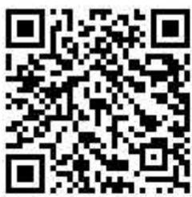
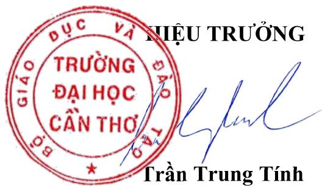
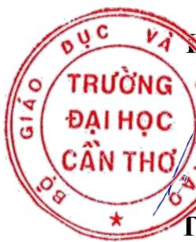

# 3530 29-7-2025 qd dinhmuchocbong 251.signed.signed

Kě toán tài chính 1 (Truòng Dai hoc Can Tho)

  
messages.pdf\_cover\_qr\_code\_label

Càn Tho, ngày 31 tháng 7 nǎm 2025

# QUYET DINH vè vièc dinh múrc hoc bǒng khuyén khích hoc tàp áp dung tir hoc ky 1, nǎm hoc 2025-2026

## HIEU TRUONG TRUONG DAI HoC CAN THO

Cǎn cir Luàt Giáo duc dai hoc ngày 18 tháng 6 nǎm 2012 và Luàt sira aói, bó sung mot só dièu cia Luàt Giáo duc dai hoc ngày 19 tháng 11 nǎm 2018;

Cǎn cir Nghi dinh só 99/2019/ND-CP cua Chinh phú ngày 30 tháng 12 nǎm 2019 quy dinh chi tiét và huóng dān thi hành mōt só dièu cua Luàt sira dói, bó sung mōt só dièu cua Luàt Giáo duc dai hoc;

Cǎn cir Thong tr só 10/2016/TT-BGDDT ngày 05/4/2016 cua Bo trróng Bo Giáo duc và Dào tao Ban hành Quy ché cóng tác sinh vièn dói vói chuong trinh dào tao dai hoc hé chinh quy và các vǎn ban có lièn quan;

Cǎn cir Nghi dinh só 84/2020/ND-CP cüa Chinh phú ngày 17 tháng 7 nǎm 2020 quy dinh chi tiét mot só dièu cua Luat Giáo duc;

Cǎn cir Nghi quyét só 99/NQ-HDT ngày 19 tháng 4 nǎm 2023 cua Hoi dòng Truòng ban hành Quy ché Tó chirc và hoat dong cia Truòng Dai hoc Càn Tho; Nghi quyét só 181/NQ-HDT ngày 19 tháng 4 nǎm 2024 và Nghi quyét só 185/NQ-HDT ngày 03 tháng 7 nǎm 2024 cua Hoi dòng Trròng vè sira dói bó sung mot só dièu cua Quy ché Tó chirc và hoat dong cia Truòng Dai hoc Càn Tho;

Cǎn cir Quy dinh vè cóng tác hoc vu dành cho sinh vién bàc dai hoc và cao dǎng he chinh quy, ban hành kèm theo Quyét dinh só 3266/QD–DHCT, ngày 15/8/2024 cua Hieu truóng Truong Dai hoc Càn Tho;

Cǎn cir To trinh só 255/TTr-CTSV, ngày 25/07/2025 cua Phòng Cong tác Sinh vien vè dièu chinh dinh mirc hoc bóng khuyén khich áp dung tir hoc kj 1, nǎm hoc 2025-2026 da duoc Ban Giám hieu phé duyét;

Theo dè nghi cua Truóng phòng Cong tác Sinh vién.

## QUYET DINH:

Dièu 1. Quy dinh Hoc bóng khuyén khich cho sinh vièn dai hoc, hoc hinh thurc chính quy tai truòng theo khói ngành nhu sau:
<table><tr><td rowspan=2 colspan=1>STT</td><td rowspan=2 colspan=2>Khói ngành</td><td rowspan=1 colspan=3>Mirc hoc bǒng (tòng/hoc ky)</td></tr><tr><td rowspan=1 colspan=1>Khá</td><td rowspan=1 colspan=1>Gioi</td><td rowspan=1 colspan=1>Xuát sác</td></tr><tr><td rowspan=1 colspan=1>1</td><td rowspan=1 colspan=1>1</td><td rowspan=1 colspan=1>KH GD và dào tao giáo vièn</td><td rowspan=1 colspan=1>6.290.000</td><td rowspan=1 colspan=1>7.550.000</td><td rowspan=1 colspan=1>8.810.000</td></tr><tr><td rowspan=1 colspan=1>2</td><td rowspan=1 colspan=1>II</td><td rowspan=1 colspan=1>Kinh doanh và quán ly, pháp luàt</td><td rowspan=1 colspan=1>6.600.000</td><td rowspan=1 colspan=1>7.920.000</td><td rowspan=1 colspan=1>9.240.000</td></tr><tr><td rowspan=1 colspan=1>3</td><td rowspan=1 colspan=1>IV</td><td rowspan=1 colspan=1>Khoa hoc sur sóng, khoa hoc tu nhièn</td><td rowspan=1 colspan=1>6.800.000</td><td rowspan=1 colspan=1>8.160.000</td><td rowspan=1 colspan=1>9.520.000</td></tr><tr><td rowspan=1 colspan=1>4</td><td rowspan=1 colspan=1>V</td><td rowspan=1 colspan=1>Toán, thóng ké máy tính, CNTT,CNKT, ky thuàt, SX và ché bién</td><td rowspan=1 colspan=1>7.540.000</td><td rowspan=1 colspan=1>9.050.000</td><td rowspan=1 colspan=1>10.560.000</td></tr><tr><td rowspan=1 colspan=1>5</td><td rowspan=1 colspan=1>VI</td><td rowspan=1 colspan=1>Súrc khòe</td><td rowspan=1 colspan=1>7.540.000</td><td rowspan=1 colspan=1>9.050.000</td><td rowspan=1 colspan=1>10.560.000</td></tr><tr><td rowspan=1 colspan=1>6</td><td rowspan=1 colspan=1>VII</td><td rowspan=1 colspan=1>Nhàn vǎn, KHXH yà hành vi, báochí va TT, DVXH, DL, KS, TDTT.</td><td rowspan=1 colspan=1>6.600.000</td><td rowspan=1 colspan=1>7.920.000</td><td rowspan=1 colspan=1>9.240.000</td></tr><tr><td rowspan=1 colspan=1>7</td><td rowspan=1 colspan=1></td><td rowspan=1 colspan=1>Chuong trinh tien tién, Chuong trinhchát luong cao tùr khóa 50 vè truóc</td><td rowspan=1 colspan=1>9.350.000</td><td rowspan=1 colspan=1>11.220.000</td><td rowspan=1 colspan=1>13.090.000</td></tr><tr><td rowspan=1 colspan=1>8</td><td rowspan=1 colspan=1></td><td rowspan=1 colspan=1>Chuong trinh tien tién, Churong trinhchát luong cao khóa 51 (áp dung tirhoc ky 2, 2025-2026)</td><td rowspan=1 colspan=1>11.330.000</td><td rowspan=1 colspan=1>13.600.000</td><td rowspan=1 colspan=1>15.860.000</td></tr></table>

\- Quy hoc bóng cua lóp: 8.0% só luong SV x Mirc hoc bóng loai Khá.

\- Quy hoc bóng cúa hoc ky dàu tièn cúa khóa hoc theo khói lóp chuyèn ngành: 8.0% só luong SV x 7.500.000 dòng/hoc ky;

\- Dinh míc binh quàn hoc bóng cua hoc ky dàu tièn cua khóa 51 (áp dung cho Sinh vién cua tát cá các chuong trinh: dai trà, tién tién, chát luong cao): 5.000.000 dòng/sinh vièn/hoc ky; Rièng SV tuyén tháng, uru tièn xét tuyén nǎm 2025 duoc huóng hoc bóng khuyén khich hoc tàp là 6.000.000 dòng/hoc ky.

Dièu 2. Thòi gian áp dung tiù hoc ky 1, nǎm hoc 2025-2026.

Dièu 3. Quyét dinh này có hièu luc ké tù ngày ky. Chánh vǎn phòng Truòng Dai hoc Càn Tho, các Trrong phòng: Cong tác Sinh vien, Dào tao, Ké hoach và Tai chính; Thú truóng các don vi và sinh vièn có lièn quan cǎn cúr quyét dinh thi hành.'

Noi nhàn:

\- Nhu Dièu 3;

\- Luu: VT, CTSV

  
DUC VA TRUONG 0 DAIHO CANTHO