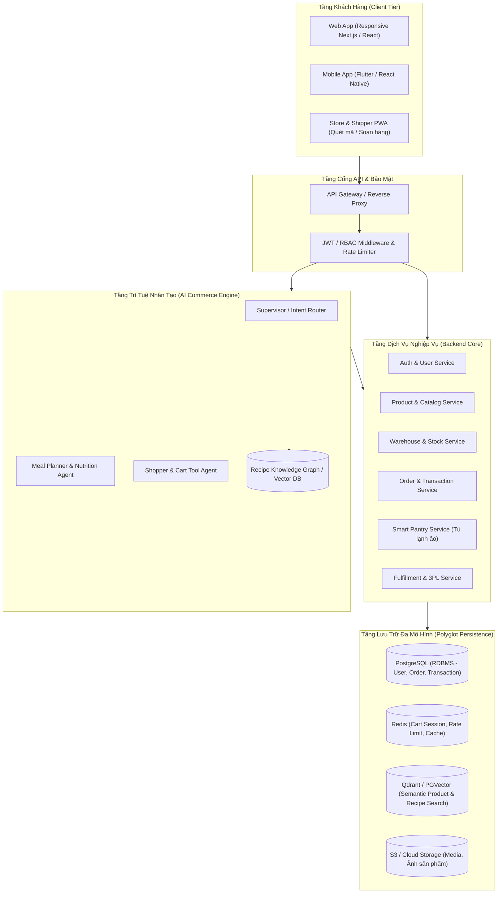
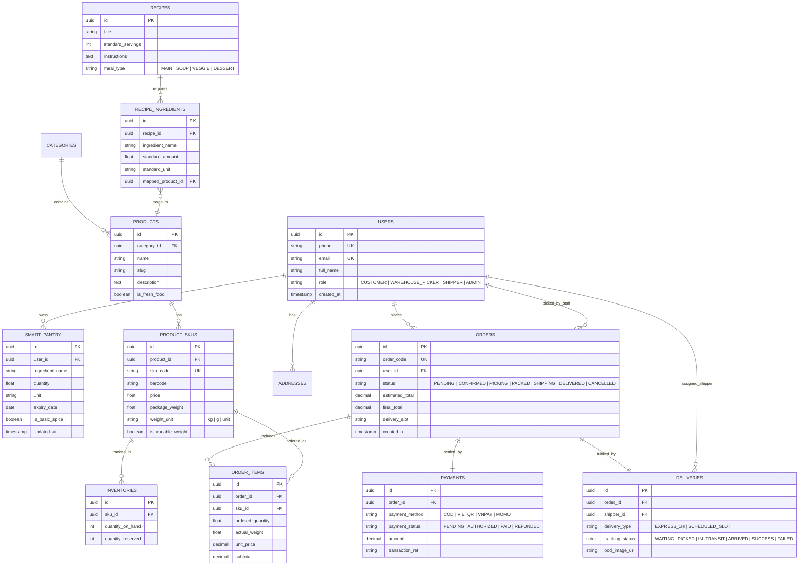
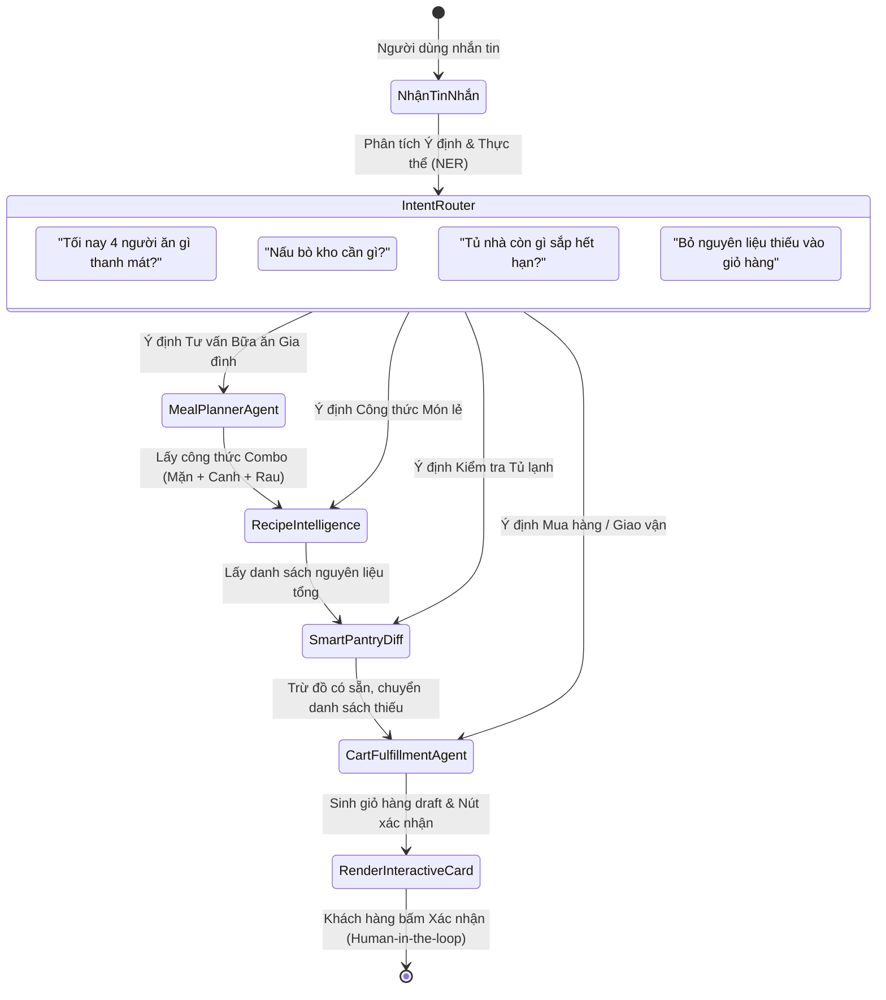
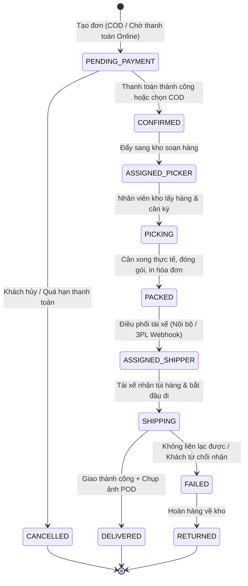

# 🛒 ĐẶC TẢ HỆ THỐNG BÁCH HÓA THÔNG MINH TÍCH HỢP TRỢ LÝ ẢO (SMART GROCERY & CONVERSATIONAL COMMERCE SYSTEM)

> **Tài liệu đặc tả yêu cầu & Thiết kế hệ thống (System Requirements & Software Architecture Specification)**  
> **Phiên bản:** 2.0.0 (Cập nhật: Đột phá Trải nghiệm Intent-Based & Bữa ăn Gia đình Thông minh)  
> **Trạng thái:** Sẵn sàng triển khai / Chuẩn đồ án & Kiến trúc sản phẩm  
> **Đối tượng:** Software Architects, Developers, AI Engineers, Product Owners  

---

## MỤC LỤC
1. [Tổng quan hệ thống (System Overview)](#1-tổng-quan-hệ-thống-system-overview)
2. [Đột phá trải nghiệm: Hệ thống Cũ (Search-based) vs. Hệ thống Mới (Intent-based)](#2-đột-phá-trải-nghiệm-hệ-thống-cũ-search-based-vs-hệ-thống-mới-intent-based)
3. [Kiến trúc hệ thống tổng thể (System Architecture)](#3-kiến-trúc-hệ-thống-tổng-thể-system-architecture)
4. [Xác thực (Authentication) & Phân quyền (RBAC Matrix)](#4-xác-thực-authentication--phân-quyền-rbac-matrix)
5. [Mô hình dữ liệu cốt lõi (Data Models & Entity Design)](#5-mô-hình-dữ-liệu-cốt-lõi-data-models--entity-design)
6. [Trọng tâm: Kiến trúc AI Chatbot & Conversational Commerce](#6-trọng-tâm-kiến-trúc-ai-chatbot--conversational-commerce)
7. [Quy trình giao dịch, kho vận & Hàng tươi sống](#7-quy-trình-giao-dịch-kho-vận--hàng-tươi-sống)
8. [Đặc tả API cốt lõi (Core RESTful Endpoints)](#8-đặc-tả-api-cốt-lõi-core-restful-endpoints)
9. [Các kịch bản sử dụng mẫu (Real-World Use Cases)](#9-các-kịch-bản-sử-dụng-mẫu-real-world-use-cases)
10. [Yêu cầu phi chức năng & Lộ trình triển khai (NFRs & Roadmap)](#10-yêu-cầu-phi-chức-năng--lộ-trình-triển-khai-nfrs--roadmap)
11. [Tổng kết](#11-tổng-kết)

---

## 1. TỔNG QUAN HỆ THỐNG (SYSTEM OVERVIEW)

### 1.1. Bối cảnh & Vấn đề
Mua sắm hàng bách hóa (thực phẩm tươi sống, rau củ quả, gia vị, đồ tiêu dùng nhanh) có tính chất rất khác biệt so với thương mại điện tử thông thường:
- **Tính chu kỳ & Thường nhật:** Người dùng mua thường xuyên nhưng tốn nhiều thời gian lên danh sách món ăn hàng ngày ("Hôm nay ăn gì?").
- **Độ phức tạp của nguyên liệu:** Để nấu một món ăn cần tổ hợp nhiều nguyên liệu và gia vị. Người dùng thường xuyên gặp tình trạng quên mua 1-2 món phụ hoặc mua trùng những thứ ở nhà đã có.
- **Hạn sử dụng & Cân nặng thực tế:** Thực phẩm có hạn dùng ngắn, khối lượng thực tế (rau, thịt, cá) thường lệch nhẹ so với định lượng niêm yết (vd: đặt 0.5kg thịt nhưng cân thực tế là 0.52kg).

### 1.2. Mục tiêu & Tầm nhìn
Xây dựng một nền tảng bách hóa thế hệ mới với trọng tâm là **Conversational Commerce (Thương mại đàm thoại)**. Chatbot không chỉ là kênh hỗ trợ khách hàng (Customer Support) đơn thuần, mà đóng vai trò là **Trợ lý nội trợ thông minh (Smart Chef & Personal Shopper)**:
1. **Hiểu ngữ cảnh ẩm thực:** Phân tích công thức món ăn, tự động bóc tách định lượng nguyên liệu cần thiết.
2. **Quản lý Tủ lạnh ảo (Smart Pantry Diff):** Đối chiếu với những nguyên liệu người dùng đã có tại nhà hoặc đã mua trong các đơn hàng trước để loại trừ, chỉ gợi ý mua những gì còn thiếu.
3. **Chuyển đổi tức thì sang Giỏ hàng (Ingredient-to-SKU Matching):** Tự động ánh xạ từ tên nguyên liệu đời thường sang mã sản phẩm (SKU) thực tế trong kho siêu thị, gợi ý sản phẩm thay thế khi hết hàng.
4. **Hỗ trợ tạo đơn & Giao vận trong chat (Human-in-the-loop Checkout):** Tạo draft giỏ hàng, áp mã giảm giá, chọn khung giờ giao hàng (Time Slot / Hỏa tốc 1-2h) và gửi thẻ xác nhận thanh toán trực tiếp trong khung chat.

---

## 2. ĐỘT PHÁ TRẢI NGHIỆM: HỆ THỐNG CŨ (SEARCH-BASED) VS. HỆ THỐNG MỚI (INTENT-BASED)

Sự khác biệt lớn nhất giữa một siêu thị trực tuyến truyền thống (như Co.opmart, WinMart, ShopeeFood/GrabMart) và **Hệ thống Bách hóa Thông minh có AI** nằm ở sự dịch chuyển từ **Search-based** (người dùng tự tìm kiếm) sang **Intent-based** (AI hiểu ý định và làm hộ toàn bộ quy trình).

### 2.1. Nỗi khổ của người dùng trên Hệ thống cũ (The Old Paradigm Pain Points)
Trên các ứng dụng siêu thị cũ, để chuẩn bị một bữa cơm gia đình, khách hàng phải trải qua một quy trình nặng nhọc gồm **7 bước thủ công kéo dài 15 - 25 phút**:
1. **Đau đầu nghĩ món:** Tự vò đầu bứt tai không biết hôm nay cả nhà ăn gì ("Hôm nay ăn gì cho thanh mát mà không ngán?").
2. **Tự nhớ tủ lạnh:** Phải mở tủ lạnh ra kiểm tra xem nhà còn thứ gì, sắp hết hạn cái gì.
3. **Tự tra công thức:** Nếu muốn nấu món mới, phải mở Google/YouTube để xem cần những gia vị gì, bao nhiêu lạng thịt.
4. **Tìm kiếm từ khóa thủ công (Search exhaustion):** Gõ tìm "thịt ba chỉ" $\rightarrow$ Lướt giữa 20 sản phẩm $\rightarrow$ Chọn 300g hay 500g? $\rightarrow$ Gõ tìm "cà chua" $\rightarrow$ Gõ tìm "hành lá" $\rightarrow$ Gõ tìm "nước mắm"...
5. **Đo đạc định lượng cảm tính:** Không biết 4 người ăn (2 người lớn, 2 trẻ em) thì cần bao nhiêu gram thịt, bao nhiêu bó rau $\rightarrow$ Dễ mua quá nhiều gây lãng phí hoặc mua quá ít bị thiếu.
6. **Bỏ quên gia vị / Mua trùng:** Rất hay quên những món nhỏ (hành ngò, ớt, gừng) hoặc mua trùng những thứ trong tủ đã có sẵn 2 chai chưa khui.
7. **Rủi ro giao trễ:** Mua xong không kịp giờ nấu cơm tối vì giao hàng không có cam kết theo khung giờ hỏa tốc chuẩn bị bữa ăn.

### 2.2. Sự Tiện Lợi Vượt Trội trên Hệ thống Mới (The New Intent-to-Cart Paradigm)
Với Hệ thống Bách hóa Thông minh, toàn bộ quy trình 20 phút được rút gọn xuống thành **1 câu chat tự nhiên kéo dài 5 giây**:

> 🗣️ **Khách hàng chỉ cần nói:**  
> *"Tối nay nhà 4 người (2 người lớn, 2 trẻ em) thích ăn món gì thanh mát, tủ lạnh đang có sẵn trứng gà và cà chua rồi."*

🤖 **AI phân tích ngầm và LÀM HẾT MỌI VIỆC CHO KHÁCH:**
- **Bước 1 (Phân tích ngữ cảnh):** Nhận diện 4 người (2 lớn, 2 nhỏ), sở thích "thanh mát", thời tiết hôm nay oi bức.
- **Bước 2 (Gợi ý Thực đơn Cân bằng 3 món):** Đề xuất nhanh 2 combo bữa cơm gia đình chuẩn dinh dưỡng (Món mặn + Món canh + Món rau/xào). Ví dụ Combo A: *Canh trứng cà chua + Thịt heo luộc cuốn bánh tráng rau sống*.
- **Bước 3 (Smart Pantry Diff):** Quét tủ lạnh cá nhân: Đã có sẵn 4 quả trứng gà + 3 quả cà chua $\rightarrow$ Gạch tên Trứng và Cà chua khỏi danh sách mua.
- **Bước 4 (Tính định lượng & Tối ưu gói kho):** Tính toán khẩu phần 4 người: Cần 500g thịt ba chỉ, 1 xấp bánh tráng cuốn, 1 rổ rau sống hỗn hợp, 1 chai mắm nêm pha sẵn. Tự động tìm đúng SKU gói nhỏ nhất còn hàng trong kho.
- **Bước 5 (Gom giỏ & Kích hoạt giao vận):** Đẩy thẳng 4 món còn thiếu vào giỏ hàng với giá 135.000đ. Hiển thị thẻ xác nhận thanh toán kèm tùy chọn: *"Giao hỏa tốc trước 17:30 để kịp nấu cơm tối nhé?"*.

---

### 2.3. Sơ đồ So sánh Hành trình Người dùng (User Journey Comparison)

```mermaid
flowchart TD
    subgraph OldSystem["❌ HỆ THỐNG CŨ (Mất 15 - 25 phút)"]
        A1["Nghĩ món ăn hôm nay"] --> A2["Mở tủ lạnh ngó nghiêng"]
        A2 --> A3["Lên web gõ tìm kiếm từng món"]
        A3 --> A4["Chọn từng loại thịt, rau, gia vị"]
        A4 --> A5["Tự nhẩm tính định lượng 4 người"]
        A5 --> A6["Thêm vào giỏ 10 lần bấm"]
        A6 --> A7["Checkout truyền thống (Hay quên mua đồ phụ)"]
    end

    subgraph NewSystem["✅ HỆ THỐNG MỚI (Mất 30 - 45 giây)"]
        B1["Chat 1 câu: Nhu cầu + Đồ nhà có sẵn"] --> B2["AI phân tích Tủ lạnh & Đề xuất Thực đơn 3 món"]
        B2 --> B3["Khách bấm chọn Combo yêu thích"]
        B3 --> B4["AI tự bóc tách định lượng, trừ đồ có sẵn, gom đồ thiếu vào giỏ"]
        B4 --> B5["Bấm 1 chạm: Xác nhận giao hỏa tốc trước giờ cơm"]
    end

    style OldSystem fill:#ffebee,stroke:#c62828,stroke-width:2px
    style NewSystem fill:#e8f5e9,stroke:#2e7d32,stroke-width:2px
```



---

## 3. KIẾN TRÚC HỆ THỐNG TỔNG THỂ (SYSTEM ARCHITECTURE)

Hệ thống được thiết kế theo mô hình **Modular Architecture (Kiến trúc phân tầng hướng dịch vụ)**, kết hợp giữa luồng xử lý giao dịch ACID chuẩn mực và luồng Agentic AI thông qua Function Calling / Tool APIs.



### 3.1. Phân chia trách nhiệm các tầng
1. **Client Tier:**
   - **Customer Portal:** Giao diện mua sắm truyền thống + Cửa sổ Chatbot tương tác tự nhiên (Drawer / Floating Widget / Fullscreen Chat).
   - **Staff & Picker Portal:** Giao diện cho nhân viên siêu thị tiếp nhận đơn, cân lại hàng thực tế, đóng gói.
   - **Shipper Portal:** Giao diện nhận đơn, tối ưu tuyến đường, cập nhật trạng thái giao hàng và ảnh chụp bằng chứng giao nhận (Proof of Delivery - POD).
2. **Backend Core Services:** Xử lý logic nghiệp vụ bách hóa, đảm bảo tính toàn vẹn dữ liệu đơn hàng và thanh toán.
3. **AI Commerce Engine:** Điều phối các Agent AI để trả lời câu hỏi, bóc tách công thức và kích hoạt các hành động thêm giỏ hàng/tạo đơn.
4. **Polyglot Storage:**
   - **PostgreSQL:** Lưu trữ dữ liệu cấu trúc (người dùng, đơn hàng, giao dịch, tồn kho).
   - **Redis:** Giỏ hàng tạm thời, session chat, khóa phân tán khi trừ tồn kho (Distributed Lock).
   - **Vector Store / Knowledge Base:** Lưu công thức nấu ăn, thuộc tính dinh dưỡng, tìm kiếm sản phẩm theo ngữ nghĩa mờ.

---

## 4. XÁC THỰC (AUTHENTICATION) & PHÂN QUYỀN (RBAC MATRIX)

### 4.1. Cơ chế Xác thực (Authentication)
- **Chuẩn giao thức:** OAuth 2.0 / OpenID Connect + JWT (JSON Web Tokens).
- **Phương thức đăng nhập:**
  - Email/Password (kèm mã hóa bcrypt/argon2).
  - Số điện thoại qua SMS OTP / Firebase Auth (tiện lợi cho người dùng mua hàng nhanh).
  - Social Login (Google, Apple, Facebook).
- **Cơ chế Token:**
  - `Access Token`: Thời hạn ngắn (15 - 30 phút), chứa `user_id`, `role`, `permissions`.
  - `Refresh Token`: Thời hạn dài (7 - 30 ngày), lưu trữ an toàn trong `HttpOnly`, `SameSite` Cookie hoặc Mobile Secure Storage, có cơ chế quay vòng token (Token Rotation).

### 4.2. Ma trận Phân quyền theo vai trò (RBAC Matrix)

Hệ thống định nghĩa 4 nhóm vai trò cốt lõi:
1. **Khách hàng (`CUSTOMER`):** Người mua hàng cá nhân / gia đình.
2. **Nhân viên soạn hàng / Kho (`WAREHOUSE_PICKER`):** Nhân viên tại điểm bán hoặc kho fulfillment.
3. **Nhân viên giao nhận (`SHIPPER`):** Giao hàng nội bộ của chuỗi siêu thị hoặc tài xế vệ tinh.
4. **Quản trị viên (`ADMIN` / `STORE_MANAGER`):** Quản lý vận hành toàn hệ thống.

| Phân hệ / Quyền hạn | CUSTOMER | WAREHOUSE_PICKER | SHIPPER | ADMIN |
| :--- | :---: | :---: | :---: | :---: |
| **Đăng ký, Đăng nhập, Profile cá nhân** | ✅ | ✅ | ✅ | ✅ |
| **Quản lý Tủ lạnh ảo (Smart Pantry)** | ✅ (Chính mình) | ❌ | ❌ | ✅ (Xem thống kê) |
| **Trò chuyện với AI Chatbot** | ✅ | ❌ | ❌ | ✅ (Xem nhật ký AI) |
| **Thêm giỏ hàng, Đặt hàng & Thanh toán** | ✅ | ❌ | ❌ | ❌ |
| **Xem / Hủy đơn hàng cá nhân** | ✅ (Trước khi soạn) | ❌ | ❌ | ✅ (Toàn quyền) |
| **Xem danh sách đơn cần soạn (Pick List)** | ❌ | ✅ | ❌ | ✅ |
| **Cập nhật cân nặng thực tế & Đóng gói** | ❌ | ✅ | ❌ | ✅ |
| **Nhận cuốc giao & Cập nhật lộ trình** | ❌ | ❌ | ✅ | ✅ |
| **Xác nhận giao thành công (Chụp ảnh POD)** | ❌ | ❌ | ✅ | ✅ |
| **Quản lý Sản phẩm, Danh mục, Giá bán** | ❌ | ❌ | ❌ | ✅ |
| **Quản lý Kho & Nhập/Xuất tồn kho** | ❌ | ✅ (Được phân quyền) | ❌ | ✅ |
| **Quản lý Người dùng & Cấp quyền RBAC** | ❌ | ❌ | ❌ | ✅ |
| **Cấu hình Tri thức Công thức (Recipe KB)** | ❌ | ❌ | ❌ | ✅ |
| **Báo cáo doanh thu & Thống kê kinh doanh** | ❌ | ❌ | ❌ | ✅ |

---

## 5. MÔ HÌNH DỮ LIỆU CỐT LÕI (DATA MODELS & ENTITY DESIGN)

### 5.1. Sơ đồ Quan hệ Thực thể (Entity Relationship Diagram - ERD)



### 5.2. Điểm nhấn trong mô hình dữ liệu bách hóa
- **`is_variable_weight` (Hàng cân ký biến đổi):** Cho phép ghi nhận `actual_weight` tại thời điểm nhân viên cân ký thực tế để điều chỉnh tiền (Refund hoặc bổ sung vào hóa đơn thanh toán).
- **`SMART_PANTRY` (Tủ lạnh cá nhân):** Theo dõi các mặt hàng khách đã có và ngày hết hạn dự kiến. Dữ liệu được nạp tự động khi hoàn tất đơn hàng hoặc do khách tự cập nhật bằng giọng nói/chat.
- **`is_basic_spice` (Gia vị cơ bản):** Phân loại các loại gia vị cơ bản (muối, tiêu, đường, nước mắm, tỏi ớt) để kích hoạt chế độ tự động bỏ qua nếu khách đã toggle "Đã có sẵn gia vị ở nhà".

---

## 6. TRỌNG TÂM: KIẾN TRÚC AI CHATBOT & CONVERSATIONAL COMMERCE

Chatbot trong hệ thống được xây dựng như một **Goal-Oriented Autonomous Agent** có khả năng ra quyết định, tra cứu dữ liệu và thực hiện các hành vi có trạng thái thông qua **Function Calling (Tool Calling)**.

### 6.1. Mô hình Multi-Agent & Phân luồng Ý định (Intent Routing)



---

### 6.2. Cơ chế Tư vấn Bữa ăn Gia đình Đa món (Balanced Family Meal Planning)
Khi khách hỏi câu hỏi mở như *"Tối nay 4 người ăn gì?"*, AI không chỉ gợi ý 1 món đơn lẻ mà tư vấn theo cấu trúc mâm cơm gia đình Việt Nam cân bằng dinh dưỡng:
1. **Công thức Mâm Cơm Cân Bằng:**
   $$\text{Mâm cơm} = \text{1 Món Mặn (Đạm)} + \text{1 Món Canh (Nước/Thanh mát)} + \text{1 Món Xào/Rau luộc (Chất xơ)}$$
2. **Đề xuất 2-3 Combo trực quan:** AI đưa ra 2 lựa chọn có sẵn trong kho để khách bấm chọn nhanh:
   - *Combo 1 (Dân dã):* Thịt kho tiêu + Canh rau ngót nấu tôm thịt + Rau muống luộc chấm tương.
   - *Combo 2 (Thanh mát):* Canh trứng cà chua + Thịt heo luộc cuốn bánh tráng rau sống.
3. **Phân tích theo thời tiết & tủ lạnh:** Nếu trời nóng, ưu tiên món canh chua/canh trứng; nếu trời mưa, ưu tiên món kho đậm đà.

---

### 6.3. Thuật toán Smart Portion Sizing, Packaging Optimization & Pantry Rollover

Để giải quyết bài toán: *"Công thức chỉ cần 150g cà chua, nhưng siêu thị chỉ bán túi 300g hoặc 500g"*:

```
[Công thức cần N gram nguyên liệu X] 
       │
       ▼
[Kiểm tra Smart Pantry]:
       Nếu User đã có >= N gram: Bỏ qua không cần mua.
       Nếu User có < N gram: Cần mua thêm (N - đã có).
       │
       ▼
[Tối ưu hóa Gói Kho (Minimum Viable Package SKU)]:
       Tìm SKU có quy cách đóng gói nhỏ nhất đang bán mà >= Lượng cần mua.
       Ví dụ: Cần 150g cà chua -> Chọn túi cà chua sạch 300g (SKU nhỏ nhất).
       │
       ▼
[Cơ chế Pantry Rollover (Tích lũy nguyên liệu thừa)]:
       Lượng dư thừa = 300g - 150g = 150g cà chua.
       Hệ thống ghi nhận: Sau khi đơn hàng hoàn tất, 150g cà chua thừa 
       sẽ TỰ ĐỘNG nạp vào `SMART_PANTRY` của khách với hạn sử dụng 5 ngày!
       Các bữa ăn sau, Chatbot sẽ tự động nhớ khách đã có 150g cà chua này.
       │
       ▼
[Toggle Gia vị cơ bản (Spice Suppression)]:
       Nếu User bật tùy chọn "Đã có sẵn gia vị cơ bản ở nhà":
       -> AI tự động loại trừ muối, đường, tiêu, bột ngọt, nước mắm, tỏi ớt ra khỏi giỏ
       để tránh làm phiền và độn giá đơn hàng không cần thiết.
```

---

### 6.4. Định nghĩa Bộ Công Cụ của Chatbot (AI Tool Definitions)

Dưới đây là các Tool chính mà LLM Agent có thể triệu hồi:

```json
[
  {
    "name": "suggest_family_meal_combos",
    "description": "Gợi ý 2-3 combo mâm cơm gia đình cân bằng (Mặn + Canh + Rau) theo số người, thời tiết và nguyên liệu sẵn có trong tủ lạnh.",
    "parameters": {
      "type": "object",
      "properties": {
        "user_id": { "type": "string" },
        "family_members": { "type": "integer", "description": "Số lượng thành viên trong gia đình", "default": 4 },
        "diet_preference": { "type": "string", "description": "Sở thích ví dụ: thanh mát, đậm đà, ít dầu mỡ" }
      },
      "required": ["user_id"]
    }
  },
  {
    "name": "lookup_recipe_ingredients",
    "description": "Tra cứu danh sách nguyên liệu và định lượng chuẩn để nấu một món ăn cụ thể theo số khẩu phần.",
    "parameters": {
      "type": "object",
      "properties": {
        "dish_name": { "type": "string", "description": "Tên món ăn, vd: canh chua cá lóc, bò kho" },
        "servings": { "type": "integer", "description": "Số người ăn (khẩu phần)", "default": 4 }
      },
      "required": ["dish_name"]
    }
  },
  {
    "name": "check_user_pantry",
    "description": "Lấy danh sách các nguyên liệu và thực phẩm mà khách hàng hiện đang có sẵn trong tủ lạnh.",
    "parameters": {
      "type": "object",
      "properties": {
        "user_id": { "type": "string", "description": "ID định danh của khách hàng" }
      },
      "required": ["user_id"]
    }
  },
  {
    "name": "match_and_add_to_cart_optimized",
    "description": "Tìm kiếm các mã sản phẩm (SKU) gói nhỏ nhất phù hợp, tự trừ nguyên liệu trong tủ và đẩy vào giỏ hàng.",
    "parameters": {
      "type": "object",
      "properties": {
        "user_id": { "type": "string" },
        "required_ingredients": {
          "type": "array",
          "items": {
            "type": "object",
            "properties": {
              "ingredient_name": { "type": "string" },
              "amount_needed": { "type": "number" },
              "unit": { "type": "string" }
            },
            "required": ["ingredient_name", "amount_needed"]
          }
        },
        "ignore_basic_spices": { "type": "boolean", "default": true }
      },
      "required": ["user_id", "required_ingredients"]
    }
  },
  {
    "name": "create_quick_delivery_order",
    "description": "Tạo nhanh đơn hàng từ giỏ hàng hiện tại với địa chỉ mặc định và chọn khung giờ giao hàng.",
    "parameters": {
      "type": "object",
      "properties": {
        "user_id": { "type": "string" },
        "delivery_type": { "type": "string", "enum": ["EXPRESS_1H", "SCHEDULED_SLOT"] },
        "payment_method": { "type": "string", "enum": ["COD", "VIETQR", "MOMO", "VNPAY"] },
        "delivery_time_slot": { "type": "string", "description": "Khung giờ vd: 17:00-19:00" }
      },
      "required": ["user_id", "delivery_type", "payment_method"]
    }
  }
]
```

---

## 7. QUY TRÌNH GIAO DỊCH, KHO VẬN & HÀNG TƯƠI SỐNG

### 7.1. Máy trạng thái Đơn hàng (Order State Machine)



### 7.2. Cơ chế xử lý Chênh lệch Cân nặng thực tế (Fresh Food Weight Variance)
1. **Lúc đặt hàng (Pre-Authorization):**
   - Giả sử khách đặt 0.5 kg Thịt ba chỉ với đơn giá 160.000đ/kg = 80.000đ.
   - Hệ thống cho phép dung sai `+/- 10%`.
2. **Lúc soạn hàng (Picking):**
   - Nhân viên kho cắt miếng thịt và đặt lên cân điện tử tích hợp: Khối lượng thực tế là **0.52 kg**.
   - Giá thực tế: `0.52 * 160.000 = 83.200đ` (chênh lệch +3.200đ).
3. **Quyết toán (Settlement):**
   - **Với COD:** Hóa đơn in ra tự động cập nhật số tiền khách cần trả là 83.200đ.
   - **Với Cổng thanh toán (VietQR/Ví điện tử):**
     - *Phương án A (Tạm giữ Auth-Capture):* Giữ số tiền tạm tính `105%`, sau khi cân xong chỉ capture số tiền thực tế `83.200đ`, số dư còn lại tự động nhả về ví khách.
     - *Phương án B (Ví điểm thưởng / Tiền thừa):* Nếu cân thiếu (vd: 0.48kg), số tiền thừa tự động cộng vào Ví điểm thưởng của khách trên hệ thống.

### 7.3. Khung giờ giao nhận (Delivery Slot & Express)
- **Giao hỏa tốc 1 giờ (Express 1H):** Phục vụ các tình huống người dùng đang nấu ăn dở và phát hiện thiếu nguyên liệu. Áp dụng cho bán kính dưới 5km từ cửa hàng gần nhất.
- **Khung giờ định kỳ (Scheduled Slots):** Chia theo ca:
  - Sáng: 08:00 - 10:00 | 10:00 - 12:00
  - Chiều: 14:00 - 16:00 | 16:00 - 18:00
  - Tối: 18:00 - 20:00 (Cao điểm giờ cơm gia đình)

---

## 8. ĐẶC TẢ API CỐT LÕI (CORE RESTFUL ENDPOINTS)

### 8.1. Nhóm Xác thực & Người dùng (`/api/v1/auth`)
- `POST /api/v1/auth/register`: Đăng ký tài khoản (Email / Số điện thoại).
- `POST /api/v1/auth/login`: Đăng nhập, trả về Access Token + Refresh Token.
- `POST /api/v1/auth/refresh-token`: Cấp mới Access Token khi token cũ hết hạn.
- `GET  /api/v1/auth/me`: Lấy thông tin cá nhân và quyền hạn hiện tại.

### 8.2. Nhóm Tủ lạnh thông minh (`/api/v1/pantry`)
- `GET    /api/v1/pantry`: Xem danh sách thực phẩm đang có trong tủ cá nhân.
- `POST   /api/v1/pantry/items`: Thêm nguyên liệu thủ công hoặc từ gợi ý.
- `PUT    /api/v1/pantry/items/{id}`: Cập nhật số lượng, hạn sử dụng.
- `DELETE /api/v1/pantry/items/{id}`: Xóa nguyên liệu khi đã sử dụng hết.

### 8.3. Nhóm AI Conversational Commerce (`/api/v1/chat`)
- `POST /api/v1/chat/completions`: Endpoint chính giao tiếp với Chatbot (hỗ trợ Server-Sent Events / Streaming).
  - **Request Body (Hỏi thực đơn bữa tối):**
    ```json
    {
      "session_id": "sess_8374921",
      "message": "Tối nay nhà 4 người (2 người lớn, 2 trẻ em) thích ăn món gì thanh mát, tủ lạnh đang có sẵn trứng gà và cà chua rồi",
      "location": { "lat": 10.7769, "lng": 106.7009 },
      "ignore_basic_spices": true
    }
    ```
  - **Response Payload (Structured Action Card):**
    ```json
    {
      "reply_text": "Chào bạn! Thời tiết chiều nay hơi oi ả, với 4 người và sẵn trứng + cà chua trong tủ lạnh, mình gợi ý bạn thực đơn thanh mát tuyệt ngon này nhé:\n- Món canh: Canh trứng cà chua thanh nhẹ\n- Món chính: Thịt heo luộc cuốn bánh tráng rau sống chấm mắm nêm\n\nMình đã trừ trứng và cà chua có sẵn, gom đủ 4 món còn thiếu vào giỏ hàng bên dưới nhé!",
      "action_type": "DRAFT_CART_CONFIRMATION",
      "data": {
        "menu_title": "Mâm cơm thanh mát gia đình 4 người",
        "already_have_in_pantry": ["Trứng gà sạch (4 quả)", "Cà chua chín (3 quả)"],
        "added_to_cart": [
          { "sku": "MEAT-PORK-BACHI-001", "name": "Thịt ba chỉ heo sạch C.P (khay 500g)", "price": 75000, "qty": 1 },
          { "sku": "DRY-BANHTRANG-002", "name": "Bánh tráng cuốn Đại Lộc túi 300g", "price": 18000, "qty": 1 },
          { "sku": "VEG-RAUSONG-001", "name": "Rổ rau sống hỗn hợp ăn bánh tráng 400g", "price": 22000, "qty": 1 },
          { "sku": "SPICE-MAMNEM-001", "name": "Mắm nêm pha sẵn Dì Cẩn chai 250ml", "price": 20000, "qty": 1 }
        ],
        "cart_total": 135000,
        "pantry_rollover_note": "Bánh tráng và mắm nêm còn thừa sau bữa ăn sẽ tự động lưu vào tủ lạnh ảo cho lần dùng sau.",
        "estimated_delivery": "Giao hỏa tốc trước 17:30 (trong 35 phút) tới 123 Nguyễn Văn Cừ"
      }
    }
    ```

### 8.4. Nhóm Giỏ hàng & Đơn hàng (`/api/v1/orders`)
- `GET  /api/v1/cart`: Lấy thông tin giỏ hàng hiện tại.
- `POST /api/v1/cart/items`: Thêm/sửa số lượng sản phẩm.
- `POST /api/v1/orders/checkout`: Tạo đơn hàng từ giỏ.
- `GET  /api/v1/orders/{order_id}`: Xem chi tiết đơn hàng và trạng thái vận chuyển.
- `POST /api/v1/orders/{order_id}/cancel`: Hủy đơn (chỉ khi đơn chưa bước vào khâu soạn hàng).

### 8.5. Nhóm Vận hành Kho & Soạn hàng (`/api/v1/fulfillment`)
- `GET  /api/v1/fulfillment/pick-list`: Lấy danh sách các đơn hàng cần soạn tại chi nhánh.
- `POST /api/v1/fulfillment/{order_id}/update-weights`: Cập nhật khối lượng cân thực tế của các mặt hàng tươi sống.
- `POST /api/v1/fulfillment/{order_id}/pack-complete`: Xác nhận đóng gói hoàn tất, sẵn sàng giao cho Shipper.

### 8.6. Nhóm Giao hàng (`/api/v1/delivery`)
- `GET  /api/v1/delivery/available-jobs`: Danh sách đơn sẵn sàng để tài xế nhận.
- `POST /api/v1/delivery/{delivery_id}/accept`: Tài xế nhận cuốc giao.
- `POST /api/v1/delivery/{delivery_id}/complete`: Xác nhận giao thành công kèm ảnh chụp POD (Proof of Delivery).

---

## 9. CÁC KỊCH BẢN SỬ DỤNG MẪU (REAL-WORLD USE CASES)

### Kịch bản 1: "Bữa Cơm Gia Đình 4 Người - Trừ Tủ Lạnh & Gom Giỏ 1 Nốt Nhạc"
- **Bối cảnh:** 16:45 chiều, người dùng chuẩn bị tan làm từ công ty, cần chuẩn bị bữa cơm tối cho 4 người (2 vợ chồng, 2 con nhỏ).
- **Người dùng:** *"Tối nay nhà 4 người (2 người lớn, 2 trẻ em) thích ăn món gì thanh mát, tủ lạnh đang có sẵn trứng gà và cà chua rồi."*
- **Chatbot thực hiện trong 2 giây:**
  1. Gọi tool `suggest_family_meal_combos(family_members=4, preference="thanh mát")`.
  2. Bóc tách thực đơn cân bằng:
     - Món canh: *Canh trứng cà chua hành hoa*.
     - Món chính: *Thịt ba chỉ luộc cuốn bánh tráng rau sống*.
  3. Gọi tool `check_user_pantry(user_id)`: Xác định trong tủ lạnh đã có *Trứng gà (4 quả)* và *Cà chua (3 quả)* $\rightarrow$ Tự động loại trừ khỏi danh sách mua.
  4. Tính toán định lượng cho 4 người: Cần 500g thịt ba chỉ heo, 1 xấp bánh tráng, 1 rổ rau sống, 1 chai mắm nêm.
  5. Gọi tool `match_and_add_to_cart_optimized()`: Lọc các gói nhỏ nhất trong kho siêu thị gần nhất $\rightarrow$ Tự động add 4 món vào giỏ hàng.
  6. Phản hồi kèm Thẻ tương tác:
     *"Mình gợi ý mâm cơm: Canh trứng cà chua + Thịt ba chỉ luộc cuốn bánh tráng rau sống. Đã trừ trứng và cà chua bạn có sẵn. Mình vừa gom Thịt ba chỉ (500g), Bánh tráng, Rau sống và Mắm nêm vào giỏ hàng: Tổng cộng 135.000đ. Giao hỏa tốc tới nhà trước 17:30 nhé?"*
- **Người dùng:** Bấm nút `[Xác nhận giao hỏa tốc]` ngay trên khung chat $\rightarrow$ Đơn hàng kích hoạt, khi về đến nhà lúc 17:30 là shipper vừa giao tới cửa.

### Kịch bản 2: "Dọn tủ lạnh thông minh (Zero-Waste Cooking)"
- **Người dùng:** *"Trong tủ nhà mình sắp hết hạn những gì, nấu được món gì ngon không?"*
- **Chatbot:**
  1. Truy vấn `SMART_PANTRY` tìm các nguyên liệu có `expiry_date` trong vòng 48 giờ tới: Phát hiện có *Ức gà (300g)*, *Ớt chuông (2 quả)*, *Hành tây (1 củ)*.
  2. Suy luận gợi ý món ăn: *"Gà xào ớt chuông hành tây"* hoặc *"Salad ức gà ớt chuông"*.
  3. Gợi ý bổ sung: *"Món Gà xào ớt chuông chỉ cần thêm một ít dầu hào và tiêu đen là chuẩn vị. Nhà mình có sẵn gia vị này chưa, hay cần mình lấy thêm một chai Dầu hào Maggi 350g (22.000đ) không?"*

### Kịch bản 3: "Xử lý hàng cân ký khi soạn đơn"
- **Khách hàng** đặt 1 con Cá chép giòn (ước tính 1.5kg x 120.000đ/kg = 180.000đ).
- **Nhân viên kho (Picker)** vớt cá từ bể, cân thực tế được **1.65kg**.
- Picker nhập `1.65` vào màn hình máy quét:
  - Hệ thống tính lại: `1.65 * 120.000 = 198.000đ`.
  - Hệ thống gửi push notification tự động về app của khách: *"Cá chép giòn của bạn có trọng lượng thực tế 1.65kg (+150g). Tiền đơn hàng được điều chỉnh thành 198.000đ."*
  - Hóa đơn in đính kèm trên túi hàng cập nhật đúng khối lượng thực tế.

---

## 10. YÊU CẦU PHI CHỨC NĂNG & LỘ TRÌNH TRIỂN KHAI (NFRS & ROADMAP)

### 10.1. Yêu cầu Phi chức năng (Non-Functional Requirements)
1. **Hiệu năng & Độ trễ (Performance & Latency):**
   - API tra cứu sản phẩm & giỏ hàng: `P95 < 200ms`.
   - Phản hồi từ Chatbot (Time-to-First-Token qua Streaming): `< 1.2s`.
   - Xử lý đồng thời (Concurrency): Tối thiểu 500 yêu cầu đặt hàng/giây trong các khung giờ cao điểm (Flash sale hoặc trước bữa ăn tối).
2. **Tính toàn vẹn dữ liệu (Data Consistency):**
   - Nghiệp vụ trừ tồn kho và thanh toán tuân thủ tuyệt đối chuẩn ACID. Áp dụng cơ chế **Pessimistic / Distributed Locking** (Redis Redlock) khi trừ tồn kho để chống Overselling (bán quá số lượng tồn kho thực tế).
3. **Bảo mật (Security):**
   - Mã hóa toàn bộ dữ liệu truyền tải qua HTTPS/TLS 1.3.
   - Dữ liệu mật khẩu và thông tin cá nhân (PII) được băm một chiều hoặc mã hóa AES-256.
   - Rate limiting trên từng IP/User để chống bot spam đặt đơn giả hoặc khai thác cạn kiệt tài nguyên AI Token.

### 10.2. Lộ trình Triển khai Đề xuất (Implementation Roadmap)

| Giai đoạn | Mục tiêu | Kết quả bàn giao chính |
| :--- | :--- | :--- |
| **Pha 1: Core Foundation (Tuần 1 - 3)** | Xây dựng lõi E-Commerce & Vận hành cơ bản | - Cơ sở dữ liệu PostgreSQL + Redis<br>- Module Auth (JWT, RBAC 4 vai trò)<br>- Module Sản phẩm, Kho, Giỏ hàng, Đặt đơn (COD, VietQR)<br>- Màn hình web quản trị & ứng dụng khách hàng cơ bản |
| **Pha 2: Smart Pantry & AI Agent (Tuần 4 - 6)** | Tích hợp Trí tuệ nhân tạo & Tủ đồ cá nhân | - Xây dựng cơ sở tri thức công thức (Recipe Knowledge Base)<br>- Triển khai Tool Calling AI Agent (LangGraph / Function Calling)<br>- Tính năng Smart Pantry & Thuật toán Pantry Diff + Packaging Optimization<br>- Giao diện khung chat tương tác với thẻ giỏ hàng động (Intent-to-Cart) |
| **Pha 3: Fulfillment & Cân ký (Tuần 7 - 9)** | Hoàn thiện chuỗi cung ứng hàng tươi sống | - Nghiệp vụ Picker cân ký hàng tươi sống & tính toán chênh lệch<br>- Tích hợp cổng thanh toán trực tuyến (VNPAY / MoMo)<br>- Phân hệ Shipper (App giao nhận, định vị, chụp ảnh POD)<br>- Tích hợp Webhook đối tác vận chuyển bên thứ 3 (Ahamove/Grab) |
| **Pha 4: Tối ưu & Mở rộng (Tuần 10+)** | Tối ưu hóa trải nghiệm & Tự động hóa | - Đề xuất thực đơn theo tuần cá nhân hóa (Personalized Meal Planning)<br>- Nhận diện hóa đơn hoặc ảnh chụp tủ lạnh qua Vision AI để tự động điền tủ đồ<br>- Kiểm thử tải (Load testing) và đóng gói triển khai Docker/Kubernetes |

---

## 11. TỔNG KẾT
Tài liệu này cung cấp bức tranh toàn diện và chi tiết nhất để phát triển **Hệ thống Bách hóa Thông minh Tích hợp Trợ lý Ảo**. Bằng cách kết hợp chặt chẽ giữa **nghiệp vụ bán lẻ bách hóa thực tế** (hạn dùng, cân nặng tươi sống, khung giờ giao) với **sức mạnh của AI Agent đàm thoại**, hệ thống giải quyết triệt để rào cản lớn nhất của người nội trợ hiện đại: *chuyển đổi từ nhu cầu ăn uống hàng ngày sang một đơn hàng đầy đủ nguyên liệu chỉ trong vài câu trò chuyện tự nhiên.*
