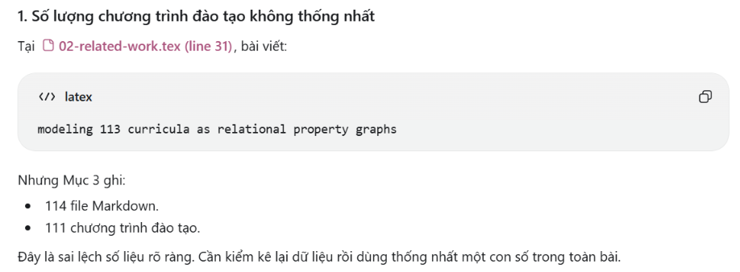

ABSTRACT

- Đa số đều khớp và đúng thông tin so với source code và mục 3,4
- Có 1 góp ý nhỏ là: Abstract viết theo hướng cả ba scenario đều được thực hiện trên “100-query held-out benchmark”. Điều này đúng với Scenario 1 và 2, nhưng không hoàn toàn đúng với Scenario 3.
- Scenario 3 thực tế sử dụng: 50 trường hợp chính cố định, Ba mức 11, 31 và 51 công cụ.

=> Chỉnh thành như này: We evaluate CTU-Chat using a 100-query held-out benchmark for architecture comparison and ablation, together with a separate 50-case semantic-neighbor tool-ambiguity stress test.

1/ INTRODUCTION

Có 2 điểm nhỏ cần sửa

- “GraphRAG” nên được dùng thận trọng: Source triển khai Neo4j và các công cụ chạy câu Cypher cố định. Vì vậy, nếu Introduction dùng “GraphRAG” để mô tả trực tiếp CTU-Chat thì nên giải thích rõ đây là truy xuất bằng Knowledge Graph, không phải toàn bộ thuật toán GraphRAG theo một framework cụ thể.

=> đổi thành: CTU-Chat uses a Neo4j-backed, tool-mediated knowledge-graph retrieval path in which specialists invoke fixed, parameterized Cypher operations rather than generating arbitrary graph queries.

=> latex: RAG augments language models with document evidence, while knowledge-graph retrieval supports structured, multi-hop access to relational information such as curricula and prerequisite chains~\cite{lewis2020rag,gao2023rag_survey,edge2024graphrag}. Agentic architectures support tool use and multi-agent coordination~\cite{yao2023react,wu2023autogen,schick2023toolformer}.

- “Cùng khả năng” cần hiểu đúng: Single Agent và CTU-Chat có cùng: Mô hình, Nguồn kiến thức, 11 công cụ nền tảng, Retrieval stack. Nhưng chúng không nhìn thấy công cụ theo cùng một cách: Single Agent thấy toàn bộ công cụ, CTU-Chat chia công cụ theo agent chuyên môn.

=> vì vậy nên sửa thành: We compare CTU-Chat with a system-level matched single-agent baseline using the same language model, knowledge snapshot, retrieval backend, production tool set, and execution budget. The evaluated difference lies in orchestration, prompt specialization, and per-agent tool visibility.

2/RELATED WORK

có 2 điểm:

- Chưa thống nhất số tài liệu hiện có:
- 
- Sửa nhẹ ở mục 2.4

3/ PROPOSED MODEL

Chỉnh nhẹ ở mục 3,2 về số lượng tài liệu

4/ Experimental Setup

Có 5 điểm cần chỉnh:

- **Định nghĩa E2E chưa khớp cách tính:** Mục 4 mô tả E2E gồm Fact Coverage, nguồn, unsupported claims, route, tool và arguments. Nhưng số liệu Scenario 1--2 thực tế chỉ tính `Fact Coverage >= 0.50`.

=> Nên ghi rõ: For Scenarios 1 and 2, E2E Success is the binary indicator $\mathbb{I}(\text{Required-Fact Coverage}\ge 0.50)$. Scenario 3 separately evaluates correct tool, arguments, result, and bounded execution.

- **Giới hạn thực thi chưa đúng với runner:** Bài ghi tối đa 3 tool calls, 2,048 output tokens và timeout 30 giây, nhưng runner chưa cưỡng chế các giới hạn này; log có lượt vượt 63.000 output tokens và 120 giây.

=> Bỏ các giới hạn trên hoặc triển khai thật và chạy lại.

- **“300 runs” dễ gây hiểu nhầm:** Thực tế là `100 câu × 3 cấu hình`, mỗi cặp câu hỏi--cấu hình chỉ chạy một lần (`reps = 1`).

=> Sửa thành: Three configurations are evaluated once on each of the 100 held-out queries, yielding 300 configuration--query runs.

- **Scenario 3 còn thiếu cách tạo số tool và coverage suite:** 11 tool gốc, thêm $m\in\{0,2,4\}$ semantic neighbors cho mỗi trong 10 nhóm, nên $|R_m|=11+10m\in\{11,31,51\}$. Ngoài 1.800 quyết định chính còn có 160 coverage decisions, tổng cộng 1.960 records.

- **Arithmetic subset chưa thống nhất:** Mục 4 và 5 ghi $N=9$, trong khi script chấm lại hiện xác định 13 câu. Cần khóa danh sách query ID và dùng thống nhất một tập.
