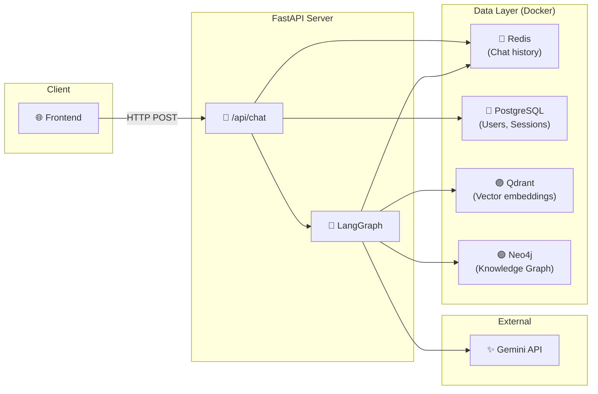
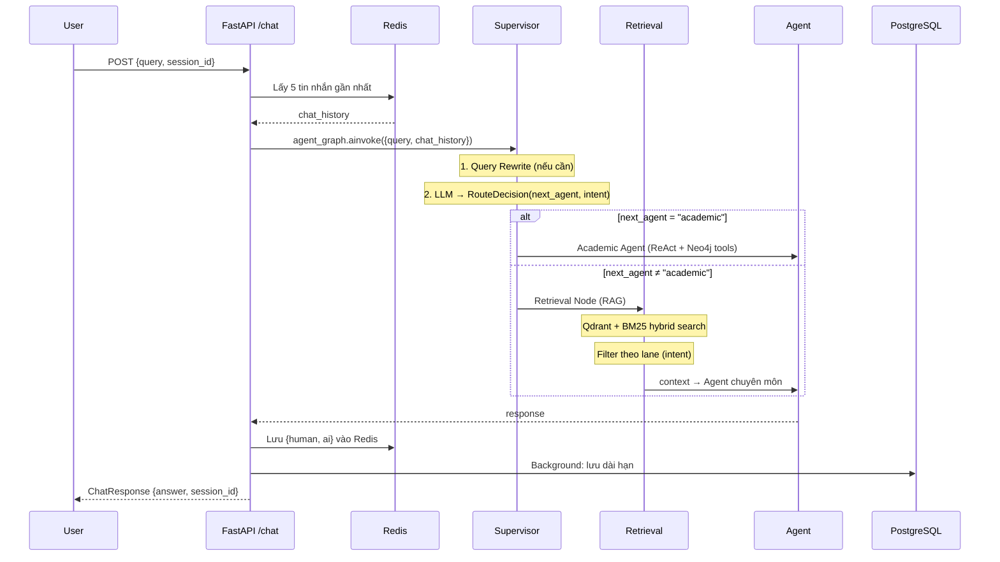
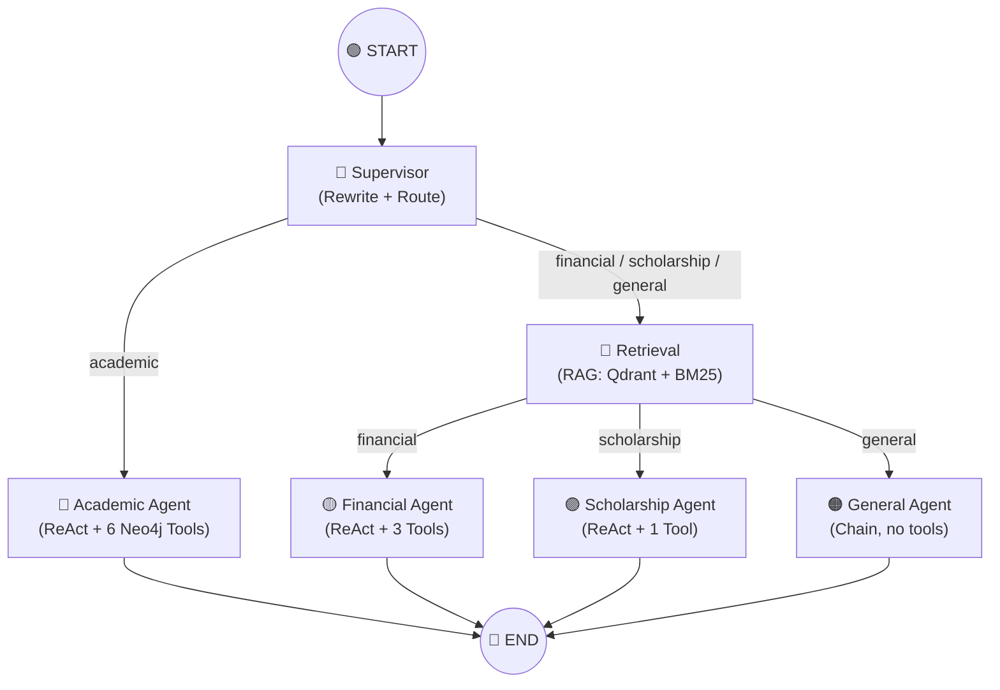
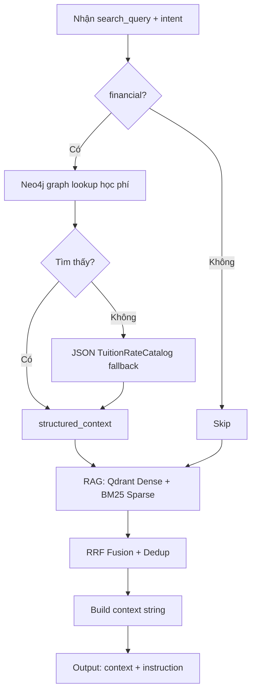

# 🏗️ Kiến trúc hệ thống — Chatbot ĐH Cần Thơ

## 1. Tổng quan

Chatbot tư vấn tuyển sinh ĐH Cần Thơ, xây dựng trên **FastAPI** + **LangGraph** multi-agent + **RAG** (Retrieval-Augmented Generation).



### Hạ tầng (Docker Compose)

| Service | Image | Port | Vai trò |
|---|---|---|---|
| **Qdrant** | `qdrant:v1.18.1` | 6333 | Vector DB — lưu embeddings tài liệu |
| **Redis** | `redis:7-alpine` | 6379 | Cache — lưu lịch sử chat ngắn hạn |
| **PostgreSQL** | `postgres:15-alpine` | 5432 | RDBMS — users, sessions, messages dài hạn |
| **Neo4j** | `neo4j:5.20.0` | 7474/7687 | Graph DB — chương trình đào tạo, học phí |

### LLM

| LLM | Model | Dùng cho |
|---|---|---|
| **Chính** | `gemini-3.5-flash-lite` | Supervisor routing + tất cả agents |
| **Phụ** | `gemini-3.1-flash-lite` | Query rewrite (nhanh, rẻ) |

---

## 2. Flow xử lý request



---

## 3. LangGraph — Kiến trúc Multi-Agent

### Supervisor Pattern

Hệ thống dùng **Supervisor Pattern** — một "bộ não" trung tâm nhận câu hỏi, phân tích, rồi điều phối đến agent chuyên môn phù hợp.



### Shared State

Tất cả nodes đọc/ghi vào [`AgentState`](file:///mnt/d/Project/Chatbot/app/agents/graph.py#L62-L78) — bộ nhớ chung:

| Field | Ghi bởi | Đọc bởi | Mô tả |
|---|---|---|---|
| `query` | Input | Tất cả | Câu hỏi gốc |
| `chat_history` | Input | Supervisor, Agents | Lịch sử hội thoại |
| `search_query` | Supervisor | Retrieval | Câu hỏi sau rewrite |
| `next_agent` | Supervisor | Routers | Agent nào xử lý |
| `routing_decision` | Supervisor | Retrieval | Intent chi tiết → chọn lane |
| `context` | Retrieval | Agents | Tài liệu RAG |
| `retrieval_instruction` | Retrieval | Agents | Hướng dẫn thêm cho agent |
| `response` | Agents | Output | Câu trả lời cuối |

---

## 4. Supervisor Node

📍 [`supervisor_node()`](file:///mnt/d/Project/Chatbot/app/agents/graph.py#L143-L217)

Supervisor làm **2 việc** trong **1 lần gọi LLM**:

### 4a. Query Rewrite

Khi câu hỏi hiện tại thiếu ngữ cảnh (chứa đại từ, lược bỏ chủ ngữ), hệ thống dùng `rewrite_llm` để tạo câu truy vấn đầy đủ:

```
Lần 1: "Học phí ngành CNTT là bao nhiêu?"
Lần 2: "Còn khóa 52 thì sao?"
         ↓ rewrite
        "Học phí ngành CNTT khóa 52 là bao nhiêu?"
```

- [`should_rewrite_query()`](file:///mnt/d/Project/Chatbot/app/services/query_intent.py#L65-L73) — kiểm tra có cần rewrite không
- [`validate_rewritten_query()`](file:///mnt/d/Project/Chatbot/app/services/query_intent.py#L444-L492) — đảm bảo rewrite không bịa thêm thông tin

### 4b. Routing — Chọn agent + intent

LLM trả về [`RouteDecision`](file:///mnt/d/Project/Chatbot/app/agents/graph.py#L84-L99) với structured output:

```python
class RouteDecision(BaseModel):
    next_agent: Literal["academic", "financial", "scholarship", "general"]
    intent: Literal[
        "actual_tuition", "exemption_basis", "exemption_policy",
        "calculation", "both", "ambiguous_tuition",
        "scholarship", "student_loan", "social_support",
        "academic_program", "academic_rules", "other",
    ]
```

| Quyết định | Mục đích | Dùng ở đâu |
|---|---|---|
| `next_agent` | **AI nào** trả lời | Routing edges trong graph |
| `intent` | **Tài liệu nào** để lấy | `build_retrieval_lanes()` → filter Qdrant/BM25 |

> [!NOTE]
> `next_agent` chọn **người**, `intent` chọn **tài liệu**. Hai quyết định bổ trợ nhau, cùng được LLM trả về trong 1 lần gọi duy nhất.

---

## 5. Hệ thống Lane — Metadata Filter cho RAG

### Lane là gì?

Lane = **bộ lọc metadata** để Qdrant/BM25 chỉ trả về đúng loại tài liệu cần thiết.

Mỗi document trong Qdrant có metadata:
```json
{
    "domain": "tuition",
    "content_kind": "rate_table",
    "fee_kind": "actual_tuition",
    "academic_year": "2024-2025"
}
```

[`RetrievalLane`](file:///mnt/d/Project/Chatbot/app/services/query_intent.py#L34-L40) định nghĩa filter tương ứng:
```python
RetrievalLane(
    name="actual_tuition",
    domain="tuition",              # ← chỉ tìm domain tuition
    content_kind="rate_table",     # ← chỉ lấy bảng giá
    fee_kind="actual_tuition",     # ← chỉ lấy học phí thực tế
    top_n=6,
)
```

### Intent → Lanes mapping

[`build_retrieval_lanes()`](file:///mnt/d/Project/Chatbot/app/services/query_intent.py#L521-L601) chuyển intent thành danh sách lanes:

| Intent | Lanes | Tài liệu được lấy |
|---|---|---|
| `actual_tuition` | `actual_tuition` (top_n=6) | Bảng học phí thực tế |
| `exemption_basis` | `exemption_basis` (top_n=6) | Bảng cơ sở tính miễn giảm |
| `exemption_policy` | `exemption_policy` (top_n=6) | Chính sách miễn giảm |
| `calculation` | `actual` + `basis` + `policy` | Cả 3 để tính toán |
| `both` / `ambiguous_tuition` | `actual` + `basis` | Cả 2 bảng giá |
| `scholarship` | `scholarship` (domain=scholarship) | Tài liệu học bổng |
| `student_loan` | `student_loan` (domain=student_loan) | Tài liệu vay vốn |
| `academic_program` | **(rỗng)** | Không cần — dùng Neo4j tools |
| `other` | `default` (không filter) | Tìm chung |

---

## 6. Retrieval Node

📍 [`retrieval_node()`](file:///mnt/d/Project/Chatbot/app/agents/graph.py#L221-L345)

Chạy **trước** financial/scholarship/general agent:



### Hybrid Search Pipeline

📍 [`engine.retrieve()`](file:///mnt/d/Project/Chatbot/app/services/rag_engine.py#L679-L780)

1. **Dense Vector Search** — Qdrant (semantic similarity) → Parent Document Retrieval
2. **Sparse Lexical Search** — BM25 (keyword matching)
3. **RRF Fusion** — Reciprocal Rank Fusion kết hợp 2 nguồn
4. **Re-ranking** — Sắp xếp lại theo relevance

---

## 7. Các Agent chi tiết

### 🔵 Academic Agent — Agent thật
📍 [`academic_agent_node()`](file:///mnt/d/Project/Chatbot/app/agents/graph.py#L350-L364)

| | |
|---|---|
| **Kiểu** | ReAct Agent (tạo 1 lần, prompt static) |
| **Data source** | Neo4j Knowledge Graph |
| **Qua Retrieval?** | ❌ Không — tự gọi tools |

**Tools** (6):

| Tool | File | Chức năng |
|---|---|---|
| `tra_cuu_nganh` | [academic_program.py](file:///mnt/d/Project/Chatbot/app/tools/academic_program.py) | Tra cứu chi tiết 1 ngành |
| `so_sanh_nganh` | ↑ | So sánh 2 ngành |
| `tim_nganh` | ↑ | Tìm ngành theo tiêu chí |
| `xem_chuoi_tien_quyet` | ↑ | Chuỗi môn tiên quyết |
| `mon_chung_giua_nganh` | ↑ | Môn chung giữa 2 ngành |
| `tim_nganh_co_mon` | ↑ | Ngành nào có dạy môn X |

**Tại sao là agent thật?** Vì nó chạy **ReAct loop** — tự suy nghĩ cần tool nào → gọi → đọc kết quả → gọi thêm nếu cần → trả lời.

---

### 🟡 Financial Agent — Agent có context sẵn
📍 [`financial_agent_node()`](file:///mnt/d/Project/Chatbot/app/agents/graph.py#L369-L393)

| | |
|---|---|
| **Kiểu** | ReAct Agent (tạo mới mỗi lần — prompt chứa context động) |
| **Data source** | RAG context (đã lấy sẵn) + Neo4j tools |
| **Qua Retrieval?** | ✅ Có |

**Tools** (3):

| Tool | File | Chức năng |
|---|---|---|
| `tra_cuu_hoc_phi_graph` | [tuition_graph.py](file:///mnt/d/Project/Chatbot/app/tools/tuition_graph.py) | Tra cứu học phí từ Neo4j |
| `tra_cuu_quy_dinh_hoc_phi` | ↑ | Tra cứu quy định (hệ số, loại hình) |
| `tinh_toan_hoc_phi` | [tuition.py](file:///mnt/d/Project/Chatbot/app/tools/tuition.py) | Tính tiền phải đóng sau miễn giảm |

**Tại sao context lấy sẵn?** Vì domain tài chính cần **chính xác tuyệt đối** — kiểm soát input (qua lane filter) để kiểm soát output. Agent chỉ đọc tài liệu đã được lọc đúng loại, tránh lẫn lộn bảng giá.

---

### 🟣 Scholarship Agent — Agent đơn giản
📍 [`scholarship_agent_node()`](file:///mnt/d/Project/Chatbot/app/agents/graph.py#L398-L422)

| | |
|---|---|
| **Kiểu** | ReAct Agent (tạo mới mỗi lần) |
| **Data source** | RAG context |
| **Qua Retrieval?** | ✅ Có |

**Tools** (1):

| Tool | File | Chức năng |
|---|---|---|
| `tinh_tien_hoc_bong` | [scholarship.py](file:///mnt/d/Project/Chatbot/app/tools/scholarship.py) | Tính tiền học bổng từ GPA + ĐRL |

---

### 🟠 General Agent — Chain (không phải agent)
📍 [`general_agent_node()`](file:///mnt/d/Project/Chatbot/app/agents/graph.py#L427-L450)

| | |
|---|---|
| **Kiểu** | Simple chain: `prompt \| llm \| StrOutputParser()` |
| **Data source** | RAG context |
| **Qua Retrieval?** | ✅ Có |
| **Tools** | ❌ Không có |

Không phải agent theo định nghĩa (không có tools, không có reasoning loop). Chỉ đọc context rồi trả lời.

---

## 8. Ví dụ chạy thực tế

### Ví dụ 1: "Học phí ngành CNTT khóa 52?"

```
1. Supervisor
   ├─ Rewrite: không cần
   ├─ LLM → RouteDecision(next_agent="financial", intent="actual_tuition")
   └─ routing_decision = QueryRoutingDecision(ACTUAL_TUITION)

2. Router: financial ≠ academic → đi retrieval

3. Retrieval
   ├─ Lane: actual_tuition (domain=tuition, fee_kind=actual_tuition)
   ├─ Neo4j graph lookup → tìm thấy → structured_context
   ├─ Qdrant + BM25 (filter fee_kind=actual_tuition) → thêm docs
   └─ Output: context chỉ chứa bảng học phí thực tế ✅

4. Financial Agent
   ├─ Đọc context → có thể gọi thêm tools
   └─ Response: "Học phí CNTT K52: 18.5 triệu/năm"

5. → END
```

### Ví dụ 2: "Tính tiền phải đóng sau giảm 70% ngành Luật?"

```
1. Supervisor
   ├─ LLM → RouteDecision(next_agent="financial", intent="calculation")

2. Retrieval
   ├─ Lane: actual_tuition + exemption_basis + exemption_policy (3 lanes!)
   ├─ Lấy bảng thực tế + bảng cơ sở miễn giảm + chính sách
   └─ Output: context đầy đủ 3 loại tài liệu ✅

3. Financial Agent
   ├─ Đọc context → gọi tool tinh_toan_hoc_phi(actual, basis, 70%)
   └─ Response: "Sau giảm 70%, bạn đóng X đồng"
```

### Ví dụ 3: "Ngành CNTT học những môn gì?"

```
1. Supervisor
   ├─ LLM → RouteDecision(next_agent="academic", intent="academic_program")

2. Router: academic → đi THẲNG vào academic_agent (KHÔNG qua retrieval)

3. Academic Agent (ReAct loop)
   ├─ Suy nghĩ: "Cần tra cứu ngành CNTT" → gọi tra_cuu_nganh("CNTT")
   ├─ Đọc kết quả: danh sách môn học...
   └─ Response: "Ngành CNTT gồm các môn: ..."

4. → END
```

---

## 9. Cấu trúc thư mục

```
Chatbot/
├── app/
│   ├── main.py                    # FastAPI entry point + lifespan
│   ├── agents/
│   │   ├── graph.py               # LangGraph StateGraph definition
│   │   └── prompts.py             # System prompts cho Supervisor + 4 Agents
│   ├── api/
│   │   ├── chat.py                # POST /chat endpoint
│   │   ├── auth.py                # JWT authentication
│   │   ├── history.py             # Chat history API
│   │   └── document.py            # Document management API
│   ├── services/
│   │   ├── rag_engine.py          # Hybrid Search (Qdrant + BM25 + RRF + Rerank)
│   │   ├── query_intent.py        # Intent classification + Lane definitions
│   │   ├── graph_service.py       # Neo4j query service
│   │   ├── tuition_catalog.py     # JSON tuition rate catalog
│   │   ├── bm25_service.py        # BM25 sparse index
│   │   └── llm_classifier.py      # ⚠️ DEAD CODE — không được import
│   ├── tools/
│   │   ├── academic_program.py    # 6 Neo4j tools cho Academic Agent
│   │   ├── tuition_graph.py       # 2 Neo4j tools cho Financial Agent
│   │   ├── tuition.py             # 1 calc tool cho Financial Agent
│   │   └── scholarship.py         # 1 calc tool cho Scholarship Agent
│   ├── core/                      # DB config, settings
│   ├── models/                    # Pydantic + SQLAlchemy models
│   └── utils/                     # Helpers
├── data/                          # Tài liệu gốc + metadata
├── frontend/                      # Static frontend
├── Graph_DB/                      # Neo4j ingestion scripts
├── docker-compose.yml             # Qdrant + Redis + PostgreSQL + Neo4j
└── requirements.txt
```
