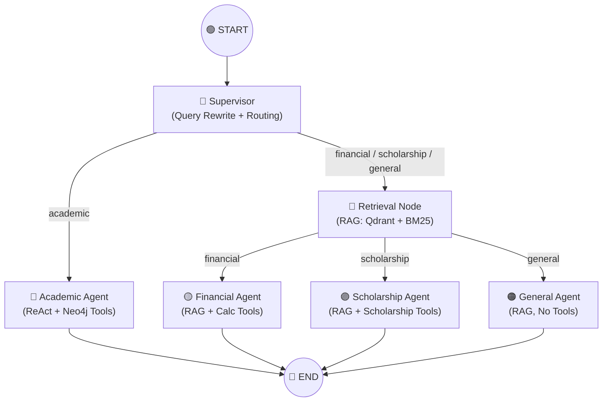
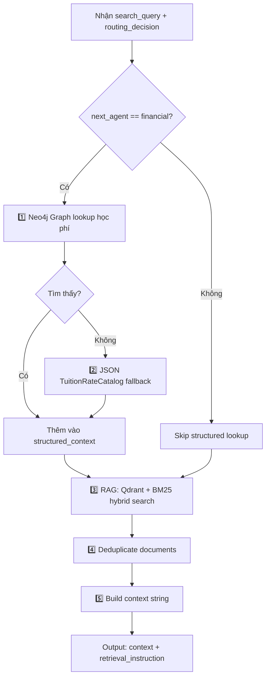

# 🧠 Giải thích kiến trúc LangGraph — Multi-Agent Chatbot ĐH Cần Thơ

## Tổng quan

Hệ thống sử dụng **LangGraph** với kiến trúc **Supervisor Pattern** — một "sếp" (Supervisor) nhận câu hỏi, phân tích, rồi điều phối đến đúng "nhân viên" (Agent) chuyên môn.



---

## 1. State — Dữ liệu chia sẻ

Toàn bộ graph hoạt động trên một **shared state** duy nhất [`AgentState`](file:///mnt/d/Project/Chatbot/app/agents/graph.py#L61-L77):

| Field | Ghi bởi | Mô tả |
|---|---|---|
| `query` | Input | Câu hỏi gốc của user |
| `chat_history` | Input | Lịch sử hội thoại |
| `search_query` | Supervisor | Câu hỏi đã rewrite (resolve đại từ, ngữ cảnh) |
| `next_agent` | Supervisor | Tên agent sẽ xử lý: `academic` / `financial` / `scholarship` / `general` |
| `routing_decision` | Supervisor | Object `QueryRoutingDecision` — quyết định lanes nào cần retrieval |
| `context` | Retrieval | Chuỗi context từ RAG (Qdrant + BM25 + structured lookup) |
| `retrieval_instruction` | Retrieval | Hướng dẫn thêm cho agent (vd: "không tìm thấy lane X") |
| `response` | Agent | Câu trả lời cuối cùng |

> [!IMPORTANT]
> Mỗi node chỉ **đọc** những field nó cần, và **ghi** vào những field nó sở hữu. LangGraph tự merge kết quả trả về vào state.

---

## 2. Supervisor Node — Bộ não điều phối

📍 [`supervisor_node()`](file:///mnt/d/Project/Chatbot/app/agents/graph.py#L143-L216)

Supervisor làm **2 việc chính**:

### 2a. Query Rewrite (nếu cần)

```
User lần 1: "Học phí ngành CNTT là bao nhiêu?"
User lần 2: "Còn khóa 52 thì sao?"  ← câu này không đủ ngữ cảnh
                ↓ rewrite
         "Học phí ngành CNTT khóa 52 là bao nhiêu?"
```

- Hàm [`should_rewrite_query()`](file:///mnt/d/Project/Chatbot/app/services/query_intent.py) kiểm tra xem câu hỏi hiện tại có chứa đại từ/thiếu ngữ cảnh không
- Nếu cần → dùng `rewrite_llm` để tạo câu truy vấn độc lập
- Validate bằng [`validate_rewritten_query()`](file:///mnt/d/Project/Chatbot/app/services/query_intent.py) để đảm bảo không bịa thêm thông tin
- Kết quả lưu vào `search_query`

### 2b. Routing — Chọn agent

- Dùng `supervisor_llm` (LLM với structured output [`RouteDecision`](file:///mnt/d/Project/Chatbot/app/agents/graph.py#L84-L88)) để chọn 1 trong 4 agent
- Prompt routing được định nghĩa tại [`SUPERVISOR_PROMPT`](file:///mnt/d/Project/Chatbot/app/agents/prompts.py#L9-L46)
- Fallback → `"general"` nếu LLM lỗi

> [!TIP]
> Supervisor dùng `llm.with_structured_output(RouteDecision)` — Gemini trả về JSON có đúng 1 field `next_agent` thay vì text tự do. Điều này đảm bảo routing không bao giờ sai format.

---

## 3. Routing — Khi nào gọi node nào?

📍 [`route_after_supervisor()`](file:///mnt/d/Project/Chatbot/app/agents/graph.py#L455-L461) và [`route_after_retrieval()`](file:///mnt/d/Project/Chatbot/app/agents/graph.py#L463-L466)

### Luồng rẽ nhánh:

```
                 supervisor
                    │
        ┌───────────┴───────────┐
        │                       │
  next_agent == "academic"   next_agent != "academic"
        │                       │
  academic_agent            retrieval
        │                       │
       END           ┌──────────┼──────────┐
                     │          │          │
               financial   scholarship  general
                  agent       agent      agent
                     │          │          │
                    END        END        END
```

| `next_agent` | Đi qua Retrieval? | Lý do |
|---|---|---|
| `academic` | ❌ Không | Academic dùng **Neo4j tools** (ReAct loop) — tự query graph database |
| `financial` | ✅ Có | Cần RAG context (học phí, quy định miễn giảm) trước khi trả lời |
| `scholarship` | ✅ Có | Cần RAG context (quy định học bổng) trước khi trả lời |
| `general` | ✅ Có | Cần RAG context (quy chế, tuyển sinh...) trước khi trả lời |

> [!NOTE]
> **Tại sao Academic không cần Retrieval?** Vì Academic Agent sử dụng mô hình **ReAct** (Reasoning + Acting) — nó tự suy nghĩ cần tool nào → gọi tool → đọc kết quả → lặp lại cho đến khi đủ thông tin. Dữ liệu đến từ Neo4j graph, không phải Qdrant.

---

## 4. Retrieval Node — Lấy ngữ cảnh RAG

📍 [`retrieval_node()`](file:///mnt/d/Project/Chatbot/app/agents/graph.py#L221-L345)

Node này chạy **trước** financial/scholarship/general agent. Nó làm:



### Chi tiết:
1. **Structured lookup** (chỉ cho financial): `graph_service.lookup_tuition()` → Neo4j, fallback `tuition_catalog.lookup()` → JSON
2. **RAG Retrieval**: Dựa trên `routing_decision`, hàm [`build_retrieval_lanes()`](file:///mnt/d/Project/Chatbot/app/services/query_intent.py) tạo ra các "lanes" — mỗi lane là 1 loại tìm kiếm cụ thể (vd: `actual_tuition`, `exemption_policy`, `scholarship`...)
3. **Deduplicate**: Loại bỏ document trùng lặp bằng `doc_id` hoặc `(source, content)`
4. **Missing lanes warning**: Nếu lane nào không tìm được document → thêm cảnh báo vào `retrieval_instruction`

---

## 5. Các Agent — Ai làm gì?

### 🔵 Academic Agent
📍 [`academic_agent_node()`](file:///mnt/d/Project/Chatbot/app/agents/graph.py#L350-L364) + [`ACADEMIC_PROMPT`](file:///mnt/d/Project/Chatbot/app/agents/prompts.py#L51-L69)

| Thuộc tính | Giá trị |
|---|---|
| Kiểu | **ReAct Agent** (prebuilt, tạo 1 lần) |
| Tools | `tra_cuu_nganh`, `so_sanh_nganh`, `tim_nganh`, `xem_chuoi_tien_quyet`, `mon_chung_giua_nganh`, `tim_nganh_co_mon` |
| Data source | Neo4j Knowledge Graph |
| Nhận context RAG? | ❌ |

### 🟡 Financial Agent
📍 [`financial_agent_node()`](file:///mnt/d/Project/Chatbot/app/agents/graph.py#L369-L393) + [`FINANCIAL_PROMPT`](file:///mnt/d/Project/Chatbot/app/agents/prompts.py#L74-L106)

| Thuộc tính | Giá trị |
|---|---|
| Kiểu | **ReAct Agent** (tạo mới mỗi lần — vì prompt chứa context động) |
| Tools | `tra_cuu_hoc_phi_graph`, `tra_cuu_quy_dinh_hoc_phi`, `tinh_toan_hoc_phi` |
| Data source | RAG context + Neo4j + JSON catalog |
| Nhận context RAG? | ✅ |

### 🟣 Scholarship Agent
📍 [`scholarship_agent_node()`](file:///mnt/d/Project/Chatbot/app/agents/graph.py#L398-L422) + [`SCHOLARSHIP_PROMPT`](file:///mnt/d/Project/Chatbot/app/agents/prompts.py#L111-L128)

| Thuộc tính | Giá trị |
|---|---|
| Kiểu | **ReAct Agent** (tạo mới mỗi lần) |
| Tools | `tinh_tien_hoc_bong` |
| Data source | RAG context |
| Nhận context RAG? | ✅ |

### 🟠 General Agent
📍 [`general_agent_node()`](file:///mnt/d/Project/Chatbot/app/agents/graph.py#L427-L450) + [`GENERAL_PROMPT`](file:///mnt/d/Project/Chatbot/app/agents/prompts.py#L133-L148)

| Thuộc tính | Giá trị |
|---|---|
| Kiểu | **Simple chain** (prompt → LLM → parse) — KHÔNG phải ReAct |
| Tools | ❌ Không có |
| Data source | RAG context |
| Nhận context RAG? | ✅ |

> [!WARNING]
> Financial và Scholarship agent được **tạo mới mỗi request** (L380-L384, L409-L413) vì prompt của chúng chứa `{context}` và `{retrieval_instruction}` — hai giá trị thay đổi mỗi lần. Ngược lại, Academic agent được tạo **1 lần duy nhất** (L134-L138) vì prompt của nó là static.

---

## 6. Ví dụ chạy thực tế

### Câu hỏi: *"Học phí ngành CNTT khóa 52 là bao nhiêu?"*

```
1. START → supervisor_node
   ├─ Query rewrite: Không cần (câu đã đầy đủ)
   ├─ Routing: LLM → RouteDecision(next_agent="financial")
   └─ Output: {search_query: "...", next_agent: "financial", routing_decision: ...}

2. route_after_supervisor → "financial" ≠ "academic" → đi vào "retrieval"

3. retrieval_node
   ├─ Financial → lookup graph_service.lookup_tuition("Học phí ngành CNTT khóa 52")
   ├─ Tìm thấy → thêm vào structured_context
   ├─ RAG: Tìm thêm docs về học phí từ Qdrant + BM25
   └─ Output: {context: "KẾT QUẢ TRA CỨU...", retrieval_instruction: "..."}

4. route_after_retrieval → "financial_agent"

5. financial_agent_node
   ├─ Tạo ReAct agent với prompt chứa context
   ├─ Agent có thể gọi thêm tools nếu cần
   └─ Output: {response: "Học phí ngành CNTT khóa 52 là X đồng/tín chỉ..."}

6. financial_agent → END ✅
```

### Câu hỏi: *"Ngành CNTT học những môn gì?"*

```
1. START → supervisor_node
   ├─ Routing: LLM → RouteDecision(next_agent="academic")
   └─ Output: {next_agent: "academic"}

2. route_after_supervisor → "academic" → đi THẲNG vào "academic_agent"
   (KHÔNG qua retrieval!)

3. academic_agent_node
   ├─ ReAct loop: Suy nghĩ → gọi tool `tra_cuu_nganh("CNTT")` → Đọc kết quả
   ├─ Nếu cần thêm: gọi thêm tools
   └─ Output: {response: "Ngành CNTT có các môn: ..."}

4. academic_agent → END ✅
```

---

## 7. Tóm tắt kiến trúc

| Thành phần | Vai trò |
|---|---|
| **LangGraph `StateGraph`** | Framework orchestration — quản lý flow giữa các nodes |
| **Supervisor** | "Bộ não" — rewrite query + chọn agent |
| **Conditional Edges** | Rẽ nhánh dựa trên `next_agent` |
| **Retrieval Node** | Lấy context RAG cho 3/4 agents |
| **4 Agents** | Mỗi agent chuyên 1 lĩnh vực, có tools riêng |
| **`AgentState`** | "Bảng trắng" chia sẻ — mọi node đọc/ghi vào đây |

> [!TIP]
> **LangGraph vs LangChain thuần**: LangChain thuần chạy tuần tự (chain). LangGraph thêm **graph execution** — cho phép rẽ nhánh có điều kiện, chạy song song, và loop (vd: ReAct loop trong agent). Nó giống như một **state machine** cho LLM workflows.
