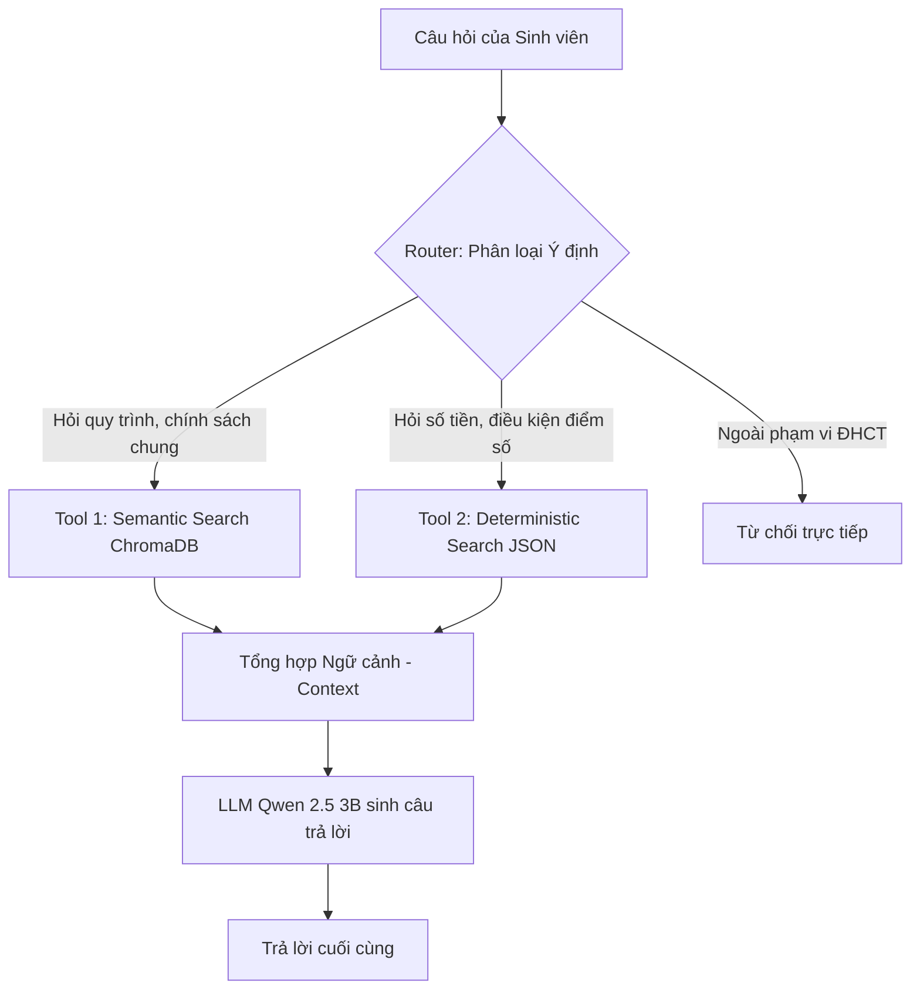

# Hướng dẫn thiết kế và xây dựng Chatbot Agent (ĐHCT Scholarship Bot)

Tài liệu này hướng dẫn cách xây dựng một **Agent** quản lý và trả lời thông tin học bổng, học phí tại Đại học Cần Thơ (ĐHCT). Cấu hình phần cứng mục tiêu là **GTX 1650 4GB VRAM** chạy mô hình **Qwen 2.5 3B** cục bộ (Local LLM qua Ollama).

---

## 1. Phân biệt RAG Cơ Bản và Agentic RAG

Trong sơ đồ bạn mô tả ở `Theorapy.md`:
`PDF -> OCR -> Chunking -> Embedding -> Lưu trữ (ChromaDB + JSON) -> Retrieval -> Generation`

* **RAG cơ bản (Naive RAG):** Nhận câu hỏi $\rightarrow$ Vector Search ChromaDB $\rightarrow$ Đưa ngữ cảnh tìm được vào LLM $\rightarrow$ Trả lời.
  * *Nhược điểm:* Nếu câu hỏi liên quan đến bảng điểm, số tiền chính xác (Deterministic Data), ChromaDB có thể trả về các chunk nhiễu, dẫn đến LLM tính toán sai hoặc bịa đặt số liệu (Hallucination).
* **Agentic RAG / Chatbot Agent:** 
  * LLM đóng vai trò là "bộ não" điều phối, có quyền truy cập vào các **công cụ (Tools)** khác nhau.
  - Khi nhận câu hỏi, Agent sẽ phân tích và quyết định gọi **Tool tra cứu ChromaDB** (cho quy trình, chính sách chung) hoặc **Tool tra cứu JSON** (cho số liệu học bổng, điểm số chính xác), sau đó tổng hợp câu trả lời cuối cùng.

---

## 2. Lựa chọn Kiến trúc Agent phù hợp với Qwen 2.5 3B (GTX 1650)

Với GPU **GTX 1650 4GB**, mô hình **Qwen 2.5 3B** là lựa chọn hợp lý nhất. Tuy nhiên, các dòng mô hình nhỏ (dưới 7B) có khả năng suy luận chuỗi (Reasoning chain) và định dạng đầu ra khá yếu.

Có 3 cách thiết kế Agent:

| Phương pháp | Cách hoạt động | Ưu điểm | Nhược điểm (đối với Qwen 2.5 3B) | Khuyên dùng |
| :--- | :--- | :--- | :--- | :--- |
| **ReAct Agent** | LLM chạy vòng lặp: *Thought $\rightarrow$ Action $\rightarrow$ Observation $\rightarrow$ Thought $\rightarrow$ Answer*. | Linh hoạt, giải quyết được bài toán phức tạp. | Quá nặng, dễ bị lặp từ (infinite loop), Qwen 3B rất dễ quên format. | ❌ **Không khuyên dùng** |
| **LLM Tool Calling** | LLM hỗ trợ native tool calling, trả về JSON chứa tên hàm và đối số cần gọi. | Chuẩn hóa, được hỗ trợ sẵn bởi LangChain/LlamaIndex. | Đôi khi Qwen 3B sinh JSON lỗi hoặc gọi sai tên tham số khi prompt dài. | ⚠️ **Cân nhắc (Cần prompt rất kỹ)** |
| **Intent Router Agent** | LLM chỉ đóng vai trò phân loại câu hỏi vào 1 trong các nhóm (Ý định). Sau đó code Python chạy hàm tương ứng. | **Cực kỳ nhanh, nhẹ, chính xác 100%**, không sợ LLM sinh lỗi format. | Kém linh hoạt hơn nếu người dùng hỏi câu hỏi phức tạp kết hợp nhiều ý định. |  **Khuyên dùng tối đa** |

---

## 3. Sơ đồ Hoạt động của Intent Router Agent



---

## 4. Hướng dẫn Triển khai Code Python (LangChain)

### 4.1. Chuẩn bị Dữ liệu JSON mẫu
Tạo file `Data/hoc_bong_K48.json` để lưu trữ số liệu chính xác:
```json
{
  "hoc_bong_khuyen_khich": {
    "khoi_nganh_I": {
      "ten": "Khoa học giáo dục và đào tạo giáo viên",
      "kha": 6290000,
      "gioi": 7550000,
      "xuat_sac": 8810000
    },
    "khoi_nganh_II": {
      "ten": "Kinh doanh và quản lý, pháp luật",
      "kha": 6600000,
      "gioi": 7920000,
      "xuat_sac": 9240000
    },
    "khoi_nganh_V": {
      "ten": "Toán, thống kê máy tính, CNTT, kỹ thuật",
      "kha": 7540000,
      "gioi": 9050000,
      "xuat_sac": 10560000
    }
  }
}
```

### 4.2. File Mã nguồn `agent.py`

Dưới đây là khung code hoàn chỉnh sử dụng **LangChain** kết hợp **ChromaDB**, **vietnamese-sbert** và **Ollama (Qwen 2.5 3B)**:

```python
import json
import os
from typing import Literal
from pydantic import BaseModel, Field
from sentence_transformers import SentenceTransformer
from langchain_core.embeddings import Embeddings
from langchain_community.vectorstores import Chroma
from langchain_community.llms import Ollama
from langchain_core.prompts import PromptTemplate
from langchain_core.output_parsers import JsonOutputParser

# ==========================================
# 1. Cấu hình Custom Embedding (vietnamese-sbert)
# ==========================================
class VietnameseSBERTEmbeddings(Embeddings):
    def __init__(self, model_name: str = "keepitreal/vietnamese-sbert"):
        # Load model SBERT tiếng Việt lên CPU hoặc GPU
        self.model = SentenceTransformer(model_name)

    def embed_documents(self, texts: list[str]) -> list[list[float]]:
        embeddings = self.model.encode(texts, show_progress_bar=False)
        return embeddings.tolist()

    def embed_query(self, text: str) -> list[float]:
        embedding = self.model.encode(text, show_progress_bar=False)
        return embedding.tolist()

# Khởi tạo embedding và ChromaDB
embeddings = VietnameseSBERTEmbeddings()
vector_db_path = "./chroma_db"

# Kết nối ChromaDB (Đảm bảo bạn đã add document vào ChromaDB trước đó)
if os.path.exists(vector_db_path):
    db = Chroma(persist_directory=vector_db_path, embedding_function=embeddings)
else:
    db = None
    print("[WARNING] Thư mục chroma_db chưa tồn tại. Hãy chạy script nạp dữ liệu trước.")

# ==========================================
# 2. Định nghĩa các hàm nghiệp vụ (Tools)
# ==========================================
def tool_search_chromadb(query: str) -> str:
    """Tra cứu các thủ tục, quy chế chung từ ChromaDB."""
    if not db:
        return "Không có kết nối tới cơ sở dữ liệu quy chế."
    # Sử dụng MMR để đa dạng hóa ngữ cảnh tìm kiếm
    retriever = db.as_retriever(search_type="mmr", search_kwargs={"k": 3})
    docs = retriever.invoke(query)
    return "\n\n".join([d.page_content for d in docs])

def tool_get_so_lieu_hoc_bong(khoi_nganh: str, loai_hb: str) -> str:
    """Truy vấn chính xác định mức học bổng từ file JSON tĩnh."""
    try:
        with open("Data/hoc_bong_K48.json", "r", encoding="utf-8") as f:
            data = json.load(f)
        
        hb_data = data.get("hoc_bong_khuyen_khich", {})
        
        # Chuẩn hóa khối ngành nhập vào
        key_nganh = f"khoi_nganh_{khoi_nganh.upper()}"
        if key_nganh not in hb_data:
            return f"Không tìm thấy dữ liệu cho khối ngành '{khoi_nganh}'. Vui lòng nhập I, II, IV, V, VI, hoặc VII."
        
        nganh_info = hb_data[key_nganh]
        loai_hb_clean = loai_hb.lower().strip()
        
        # Ánh xạ loại học bổng
        map_loai = {"khá": "kha", "khả": "kha", "giỏi": "gioi", "xuất sắc": "xuat_sac", "xuat sac": "xuat_sac"}
        key_loai = map_loai.get(loai_hb_clean, loai_hb_clean)
        
        if key_loai not in nganh_info:
            return f"Không tìm thấy loại học bổng '{loai_hb}'. Vui lòng nhập: Khá, Giỏi hoặc Xuất sắc."
        
        so_tien = nganh_info[key_loai]
        # Định dạng tiền tệ VND
        so_tien_str = f"{so_tien:,}".replace(",", ".") + " đ"
        
        return f"Mức học bổng khuyến khích loại {loai_hb.upper()} của {nganh_info['ten']} (Khối {khoi_nganh.upper()}) là: {so_tien_str}/học kỳ."
    except FileNotFoundError:
        return "Không tìm thấy file dữ liệu học bổng JSON."
    except Exception as e:
        return f"Lỗi truy vấn dữ liệu học bổng: {str(e)}"

# ==========================================
# 3. Phân loại ý định bằng LLM (Router)
# ==========================================
class RouterOutput(BaseModel):
    intent: Literal["QuyChe", "SoLieu", "NgoaiPhamVi"] = Field(
        description="Phân loại ý định của câu hỏi: 'QuyChe' nếu hỏi thủ tục/quy trình, 'SoLieu' nếu hỏi con số học bổng/bảng điểm cụ thể, 'NgoaiPhamVi' nếu câu hỏi không liên quan đến ĐHCT."
    )
    khoi_nganh: str = Field(default="", description="Nếu intent là SoLieu, trích xuất khối ngành (ví dụ: I, II, V). Nếu không có thì để trống.")
    loai_hb: str = Field(default="", description="Nếu intent là SoLieu, trích xuất loại học bổng (ví dụ: Khá, Giỏi, Xuất sắc). Nếu không có thì để trống.")

def route_query(user_query: str, llm) -> RouterOutput:
    parser = JsonOutputParser(pydantic_object=RouterOutput)
    
    router_prompt = PromptTemplate(
        template="""Bạn là AI phân loại ý định câu hỏi cho Trợ lý ĐHCT.
Hãy phân tích câu hỏi của sinh viên và trả về định dạng JSON chính xác theo yêu cầu.

Câu hỏi sinh viên: "{query}"

{format_instructions}
""",
        input_variables=["query"],
        partial_variables={"format_instructions": parser.get_format_instructions()}
    )
    
    chain = router_prompt | llm | parser
    try:
        result = chain.invoke({"query": user_query})
        return RouterOutput(**result)
    except Exception:
        # Dự phòng bằng rule-based đơn giản nếu LLM parsing lỗi
        q_lower = user_query.lower()
        if "bao nhiêu" in q_lower or "số tiền" in q_lower or "định mức" in q_lower:
            # Đoán khối ngành và loại học bổng sơ bộ
            khoi = "V" if "khối 5" in q_lower or "khối v" in q_lower else "I"
            loai = "khá"
            if "giỏi" in q_lower: loai = "giỏi"
            elif "xuất sắc" in q_lower: loai = "xuất sắc"
            return RouterOutput(intent="SoLieu", khoi_nganh=khoi, loai_hb=loai)
        return RouterOutput(intent="QuyChe")

# ==========================================
# 4. Hàm chạy chính (Main Agent Pipeline)
# ==========================================
def chatbot_agent(user_query: str) -> str:
    # Khởi tạo mô hình Qwen 2.5 3B qua Ollama
    llm = Ollama(model="qwen2.5:3b", temperature=0.0)
    
    # Bước 1: Phân tuyến câu hỏi
    routing_info = route_query(user_query, llm)
    
    print(f"[DEBUG] Phân tích Ý định: {routing_info.intent} | Khối: {routing_info.khoi_nganh} | Loại: {routing_info.loai_hb}")
    
    # Bước 2: Xử lý theo từng ý định
    if routing_info.intent == "NgoaiPhamVi":
        return "Tôi là Trợ lý Ảo của ĐHCT. Tôi chỉ hỗ trợ giải đáp các quy định về học bổng, học phí và chính sách sinh viên."
        
    elif routing_info.intent == "SoLieu":
        # Truy vấn trực tiếp từ JSON tĩnh để đảm bảo chính xác 100% con số
        res = tool_get_so_lieu_hoc_bong(routing_info.khoi_nganh, routing_info.loai_hb)
        return res
        
    else:  # QuyChe (RAG)
        # Thực hiện Semantic Search trên ChromaDB
        context = tool_search_chromadb(user_query)
        
        # Gửi ngữ cảnh vào LLM để sinh câu trả lời tự nhiên
        generation_prompt = PromptTemplate(
            template="""Bạn là "Trợ lý Ảo ĐHCT", chuyên viên tư vấn chế độ chính sách sinh viên của Đại học Cần Thơ.
Nhiệm vụ của bạn là trả lời câu hỏi dựa trên phần [TÀI LIỆU THAM KHẢO] được cung cấp.

QUY TẮC TỐI THƯỢNG:
1. Chỉ sử dụng thông tin trong [TÀI LIỆU THAM KHẢO]. Không tự bịa đặt thông tin.
2. Trả lời lịch sự, chuyên nghiệp bằng Tiếng Việt.

[TÀI LIỆU THAM KHẢO]
{context}

Câu hỏi sinh viên: {query}
Trả lời:""",
            input_variables=["context", "query"]
        )
        
        gen_chain = generation_prompt | llm
        return gen_chain.invoke({"context": context, "query": user_query})

# ==========================================
# Test chạy thử nghiệm
# ==========================================
if __name__ == "__main__":
    # Test câu hỏi tra cứu quy định (ChromaDB)
    print("--- Test 1 (Quy chế) ---")
    print(chatbot_agent("Làm sao để tôi xin gia hạn thời gian đóng học phí?"))
    
    # Test câu hỏi số liệu chính xác (JSON)
    print("\n--- Test 2 (Số liệu JSON) ---")
    print(chatbot_agent("Cho mình hỏi học bổng loại giỏi của khối ngành V là bao nhiêu tiền vậy?"))
```

---

## 5. Các bước tiếp theo để bạn thực hiện

1. **Cài đặt thư viện:**
   Chạy file `setup_venv.bat` để kích hoạt môi trường ảo `venv` và cài đặt các thư viện cần thiết:
   ```bash
   pip install langchain langchain-community langchain-core chromadb sentence-transformers pydantic ollama
   ```
2. **Cài đặt Ollama và tải model:**
   * Tải Ollama tại [ollama.com](https://ollama.com).
   * Chạy lệnh trong terminal để tải Qwen 2.5:
     ```bash
     ollama run qwen2.5:3b
     ```
3. **Chuẩn bị file data JSON:** Tạo thư mục `Data/` trong dự án của bạn và viết file `hoc_bong_K48.json` chứa các bảng biểu mà bạn đã trích xuất từ OCR (như bảng Điều 1 trong file PDF).
4. **Viết script Nạp dữ liệu (Ingestion):** Viết một file python phụ (ví dụ `ingest.py`) để đọc các file văn bản đã OCR của bạn $\rightarrow$ Chunking $\rightarrow$ Tạo vector ChromaDB lưu vào thư mục `./chroma_db`.
