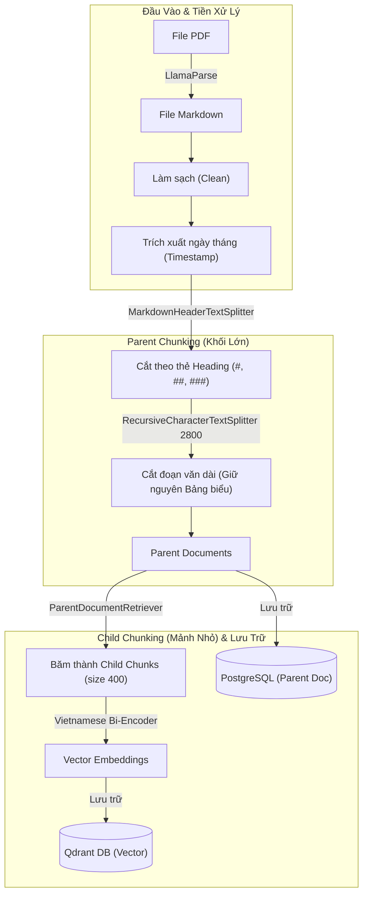

## Goal Description
Mục tiêu là làm rõ 2 luồng xử lý cốt lõi trong hệ thống Chatbot của bạn dựa trên toàn bộ source code (`rag_engine.py`, `chat.py`, `batch_process.py`), từ đó xây dựng 2 sơ đồ Mermaid trực quan, chính xác tuyệt đối và không bị "ảo giác".

Hai luồng bao gồm:
1. **Luồng Ingestion & Chunking**: Từ file gốc (PDF/Markdown) cắt nhỏ và nạp vào Qdrant (Vector) & PostgreSQL (Parent Document).
2. **Luồng RAG (Retrieval, Augmented, Generation)**: Quá trình xử lý câu hỏi của người dùng từ khi tiếp nhận đến khi sinh ra câu trả lời cuối cùng.

## User Review Required
> [!IMPORTANT]
> Vui lòng kiểm tra kỹ các sơ đồ Mermaid bên dưới để đảm bảo luồng logic phản ánh đúng chính xác những gì bạn mong muốn. Sau khi bạn duyệt (Approve), hệ thống sẽ lưu nhận thức này.

## Proposed Changes

### 1. Luồng Ingestion & Chunking (Xử lý tài liệu đầu vào)
Quá trình diễn ra chủ yếu ở `batch_process.py` và `rag_engine.py`.

*   **Đầu vào:** File PDF.
*   **OCR:** `LlamaParseAsyncClient` chuyển đổi PDF thành Markdown.
*   **Tiền xử lý:** Làm sạch Markdown (Clean).
*   **Metadata:** Trích xuất ngày tháng (Temporal extraction) từ text để tạo `timestamp`.
*   **Chunking (Cấp 1 - Parent):** `MarkdownHeaderTextSplitter` cắt theo các thẻ `#`, `##`, `###`.
*   **Chunking (Cấp 2 - Parent):** `RecursiveCharacterTextSplitter` (size 2800) cắt nhỏ các đoạn văn quá dài, nhưng **BẢO TOÀN NGUYÊN VẸN** các bảng biểu (table).
*   **Chunking (Cấp 3 - Child):** `ParentDocumentRetriever` tiếp tục băm Parent thành các đoạn siêu nhỏ Child (size 400).
*   **Embedding & Storage:** 
    *   Child chunks -> Embedding (`bkai-foundation-models/vietnamese-bi-encoder`) -> Qdrant DB.
    *   Parent chunks -> PostgreSQL (`PostgresDocStore`).

**Sơ đồ Mermaid (Ingestion):**


---

### 2. Luồng RAG (Retrieval, Augmented, Generation)
Quá trình diễn ra chủ yếu ở `chat.py`.

*   **Retrieval (Truy xuất):**
    *   Lấy 5 tin nhắn lịch sử từ Redis.
    *   **Query Rewrite:** Dùng LLM nội bộ (Groq/Llama) và lịch sử để viết lại câu hỏi cho đầy đủ ngữ cảnh (nếu có lịch sử).
    *   **Vector Search:** Tìm top 10 Child Chunks trong Qdrant bằng câu hỏi đã rewrite.
    *   **Parent Mapping:** Dựa vào ID của Child, lôi 10 Parent Documents tương ứng từ PostgreSQL.
    *   **Re-ranking:** Đưa 10 Parent Docs qua `TemporalCrossEncoderReranker` (`BAAI/bge-reranker-v2-m3`). Xếp hạng theo độ liên quan, nếu điểm sát nhau (tie-break) thì ưu tiên `timestamp` mới hơn. Giữ lại top 3 Parent Docs.
*   **Augmented (Tăng cường):**
    *   Gói gọn Câu hỏi gốc, Lịch sử Chat và 3 Parent Docs (Context) thành một Prompt duy nhất.
*   **Generation (Tạo sinh):**
    *   Gửi Prompt cho `Gemini 3.1 Flash Lite` (`llm_with_tools`).
    *   Nếu Gemini kích hoạt tool (`tinh_tien_hoc_bong`), thực thi tool và nhồi kết quả lại cho Gemini.
    *   Gemini sinh ra câu trả lời cuối cùng.
    *   Lưu lịch sử ngắn hạn vào Redis và lưu dài hạn vào PostgreSQL (chạy nền).

**Sơ đồ Mermaid (RAG):**
```mermaid
flowchart TD
    %% Bắt đầu
    User["Người dùng"] -->|Gửi Câu hỏi| API["API /chat"]

    %% Giai đoạn Retrieval
    subgraph Retrieval ["1. RETRIEVAL (Truy xuất)"]
        API -->|Lấy 5 tin nhắn| R1[("Redis (Lịch sử)")]
        R1 -.-> Rewrite["Query Rewriter (LLM)"]
        API --> Rewrite
        Rewrite -->|Câu hỏi đã rõ nghĩa| VectorSearch["Tìm kiếm Vector (Top 10)"]
        
        VectorSearch -->|Khớp Vector| QD[("Qdrant DB (Child)")]
        QD -.->|Child ID| ParentFetch["Lấy Parent Document"]
        ParentFetch -->|Fetch 10 Parents| PG[("PostgreSQL (Parent)")]
        
        PG -.-> Rerank["Re-ranker (Cross-Encoder)"]
        Rerank -->|Lọc Top 3 & Tie-break Timestamp| Top3["Top 3 Parent Docs"]
    end

    %% Giai đoạn Augmented
    subgraph Augmented ["2. AUGMENTED (Tăng cường)"]
        Top3 --> PromptBuilder["Đóng gói Prompt"]
        R1 -.-> PromptBuilder
        API -.->|Câu hỏi gốc| PromptBuilder
        PromptBuilder -->|Prompt hoàn chỉnh| ReadyPrompt["Context + History + Query"]
    end

    %% Giai đoạn Generation
    subgraph Generation ["3. GENERATION (Tạo sinh)"]
        ReadyPrompt --> Gemini["Gemini 3.1 Flash Lite"]
        
        Gemini <-->|Nếu cần tính học bổng| Tool["Tool: tinh_tien_hoc_bong"]
        Gemini --> Response["Câu trả lời (AI Response)"]
    end

    %% Lưu kết quả
    Response -->|Hiển thị| User
    Response -->|Lưu ngắn hạn| R1
    Response -->|Lưu dài hạn (Background)| PG2[("PostgreSQL (ChatSession)")]
```

## Verification Plan
1. Xác nhận các thành phần trong sơ đồ phản ánh ĐÚNG file `rag_engine.py` và `chat.py`.
2. Xác nhận luồng đi (Flow) chính xác với thứ tự thực thi trong hệ thống của bạn (từ LlamaParse -> Qdrant/Postgres và từ Query -> Redis -> Qdrant -> Postgres -> Reranker -> Gemini).
